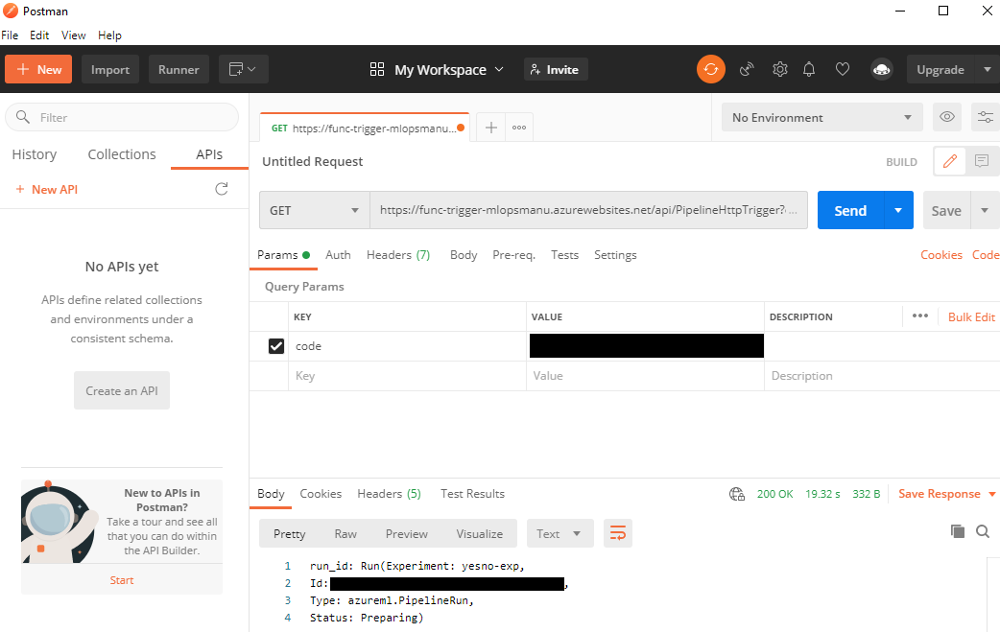

<!-- Overview -->
# Overview

When using Azure Machine Learning(AML) Service, there are cases where it is necessary to operate the pipeline under various business scenario. This sample demonstrates a scenario where users without access to AML can trigger an AML pipeline using an azure function.

**What does this sample demonstrate:**
- How to invoke AML pipeline using Azure Function

**What doesn't this sample demonstrate**:
- Azure Machine Learning Service Creation.


<!-- REPO STRUCTURE -->
# Repo Structure

This repo contains sample code to trigger Azure ML pipelines from Azure Functions.

The folders are structured as following -
```
common
  └── pipeline_trigger
        ├── devops_pipelines # Azure DevOps CI/CD pipeline definition
        ├── environment_setup # Azure DevOps IaC pipeline definition to provision Azure resources
        ├── media # images for README
        │
        ├── src
        │    ├── PipelineHttpTrigger # scripts for pipeline trigger
        │    ├── .funcignore
        │    ├── host.json
        │    ├── local.settings.json.example
        │    └── requirements.txt
        │
        ├── tests
        │      └── src
        │           └── PipelineHttpTrigger
        │                    └── test_pipeline_http_trigger.py # unit test for pipeline trigger
        │
        ├── .flake8 # configuration file for linter flake8
        ├── .gitattributes
        ├── .gitignore
        └── README.md # explains what the sample is demonstrating and how to run it
```

<!-- ABOUT THE FOLDER -->
## About The Folder

This 'pipeline_trigger' folder contains source code for an Azure Function below:

|Function|Purpose|
|-|-|
|PipelineHttpTrigger|HTTP trigger - This function will be triggered to run the AML pipeline when manually HTTP request including key is sent.|

<!-- GETTING STARTED -->
# Getting Started

- [1. Create Azure Resources](##1.-Create-Azure-Resources)
- [2. Set AML access right to Azure Function](##2.-Set-AML-access-right-to-Azure-Function)
- [3. Option 1: Deploy the function project to Azure - Local](##3.-Option-1:-Deploy-the-function-project-to-Azure---Local)
- [3. Option 2: Deploy the function project to Azure - CI/CD in Azure DevOps](##3.-Option-2:-Deploy-the-function-project-to-Azure---CI/CD-in-Azure-DevOps)
- [4. How to use pipeline trigger](##4.-How-to-use-pipeline-trigger)
- [How to renew a key](##How-to-renew-a-key)
- [Linting and Testing](##Linting-and-Testing)

## 1. Create Azure Resources
Please refer to this [README.md](environment_setup\provisioning\README.md) under environment_setup/provisioning


## 2. Set AML access right to Azure Function

1. Enable System Assigned Identity
  

1. Give **Contributor** permission to Azure Function Service Principal
  


### 3. Option 1: Deploy the function project to Azure - Local

1. Install [Azure CLI version 2.4 or later](https://docs.microsoft.com/en-us/cli/azure/install-azure-cli). Make sure to check the version by running `az --version`.

1. Install [Azure Functions Core Tools version 3.x](https://docs.microsoft.com/en-us/azure/azure-functions/functions-run-local?tabs=windows%2Ccsharp%2Cbash#v2).

1. Python 3.8 (64-bit), Python 3.7 (64-bit), Python 3.6 (64-bit), which are all supported by version 3.x of Azure Functions. Make sure by running `python --version` (Linux/macOS) or `py --version` (Windows) to check your Python version reports 3.8.x, 3.7.x or 3.6.x.

1. Install pip packages using reqirements.txt in `src` folder.
    ```sh
    $ pip install -r requirements.txt
    ```

1. Login to Azure:
    ```sh
    $ az login
    ```

1. Check which subscription you are currently using:
    ```sh
    $ az account show -o table
    ```

    If you are not in the subscription you want to use, use 'az account set -s [subscription id]' to switch. You can use 'az account list' to get all the subscription id.

1. Deploy your local functions project by using the `func azure functionapp publish` command. Replace <APP_NAME> with the name of your app.
    ```sh
    $ func azure functionapp publish <APP_NAME>
    ```


## 3. Option 2: Deploy the function project to Azure - CI/CD in Azure DevOps

This sample contains Azure DevOps pipeline yaml files in devops_pipelines folder.
To use Azure DevOps pipeline, follow the steps below.

1. Update values for [variables-template.yml](.\devops_pipelines\variables-template.yml).
1. Create Azure pipeline by using [trigger-functions-ci.yml](.\devops_pipelines\trigger-functions-ci.yml) and run it.


## 4. How to use pipeline trigger
1. Go to Function App `func-trigger-(BASE_NAME)`
1. Click `Functions` and select `PipelineHttpTrigger`
  
1. Click `Code + Test` and then click `Get function URL`
  
1. Copy URL which is including a key
  
1. Past the URL to Postman and send it
  
## How to renew a key
Please follow the steps below when you want to renew a key.
1. Go to Function App `func-trigger-(BASE_NAME)`
1. Click `Functions` and select `PipelineHttpTrigger`
1. Click `Function Keys`
1. Click `Renew key value` of default
  


## Linting and Testing

### Flake8

This sample uses [Flake8](https://flake8.pycqa.org/en/latest/) as linting tool. See [.flake8](./.flake8) for rule settings.

### Pytest

This sample uses [pytest](https://docs.pytest.org/) for unit testing python code.
[test_pipeline_http_trigger.py](.\tests\src\PipelineHttpTrigger\test_pipeline_http_trigger.py) demonstrate how to mock Azure Function Python SDK and write unit test code.

<!-- REFERENCES -->
# References

* [Quickstart: Create a Python function in Azure from the command line](https://docs.microsoft.com/en-us/azure/azure-functions/create-first-function-cli-python?tabs=azure-cli%2Cbash%2Cbrowser)
* [Azure Functions Python developer guide](https://docs.microsoft.com/en-us/azure/azure-functions/functions-reference-python)
* [Set up authentication - Azure Machine Learning | Microsoft Docs](https://docs.microsoft.com/en-us/azure/machine-learning/how-to-setup-authentication)