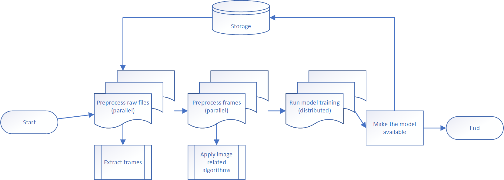
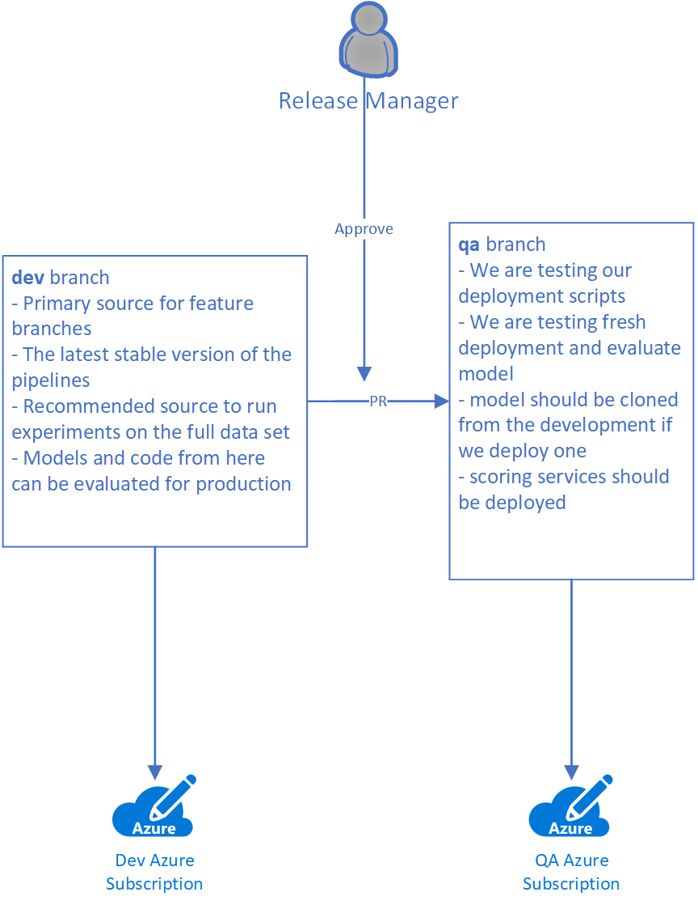
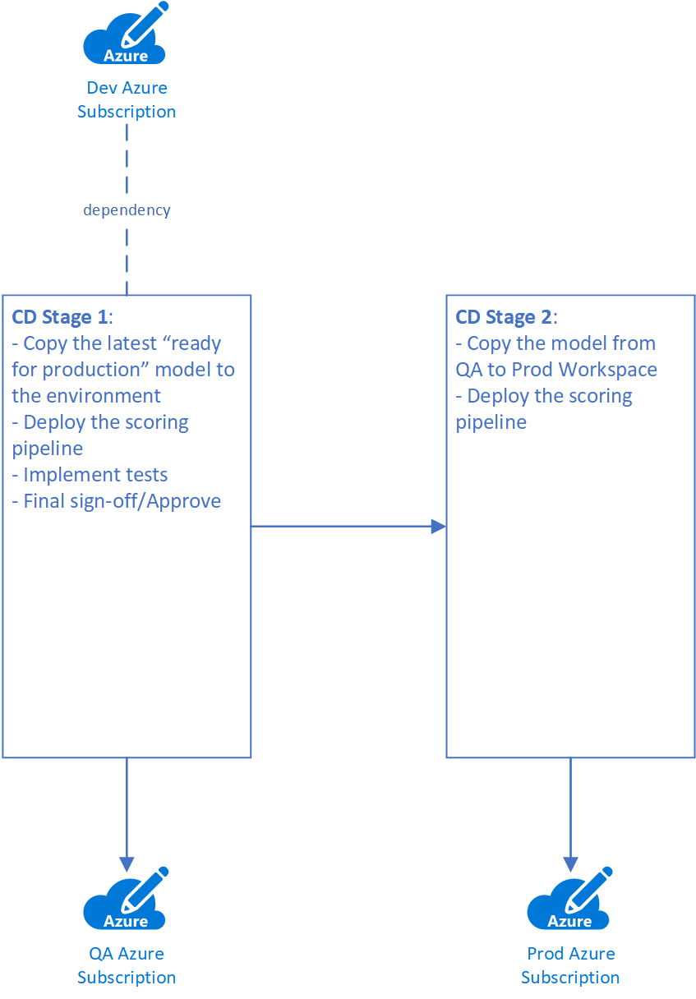

# MLOps Architecture #

MLOps in this doc refers to the development and operations process for machine learning, especially the process to develop machine learning pipelines in a large team and deploy the pipelines to production with machine learning models. The primary goal of this document is to show how to implement MLOps process in a project from scratch.

* [Machine Learning Pipelines](#machine-learning-pipelines)
  * [Primary development artifacts for MLOps process](#primary-development-artifacts-for-mlops-process)
  * [Manage artifacts with Azure Machine Learning](#manage-artifacts-with-azure-machine-learning)
  * [ML pipelines and data scientists](#ml-pipelines-and-data-scientists)
* [Development Process](#development-process)
  * [Branch name utilization](#branch-name-utilization)
  * [Pull request builds](#pull-request-builds)
  * [Development branch builds](#development-branch-builds)
* [Deployment Process](#deployment-process)
  * [CI/CD on the development branch](#ci/cd-on-the-development-branch)
  * [Multi-branch strategy](#multi-branch-strategy)
  * [Model Deployment](#model-deployment)

## Machine Learning Pipelines ##

### Primary development artifacts for MLOps process ###

There are several main artifacts in MLOps:

* Machine Learning pipelines
* Training and Scoring datasets
* Models

The primary one is Machine Learning pipeline.

ML models can be built by executing a ML pipeline, and if the same dataset is used for training, the quality of the model should be largely similar.

Datasets are important from many different perspectives including traceability, data labeling, and data drift detection. Each of these topics warrants its own guideline agnostic to MLOps. Here we assume an immutable dataset in a fixed location, and it’s possible to pass the information about the dataset to the ML pipeline as a parameter. If we would like to compare performance and execute pipelines on several different datasets, we will just pass different parameters.

Machine Learning pipelines are often considered a process that generates a new model at the end, however, it can be any process that uses machine learning patterns and practices or a part of bigger ML process. It’s common to see data preprocessing pipelines or scoring pipelines for batch scenarios, and even pipelines that orchestrate training based on cognitive services. **ML pipeline** is a set of steps that can be executed sequentially or in parallel, where each step can be executed on a single node or a set of nodes to speed up tasks. Parallel processing is one of the main reasons to use pipelines. The pipeline itself defines not just the steps but compute resources where the steps should be executed, related datasets, and data stores. So pipeline implementation is specific to a particular set of technologies.

Let’s look at an example: imagine that we need to train a model to find anomalies in raw video frames (bad pixels). In real life it’s not common to have a ready-to-use dataset. It means that you have to implement preprocessing steps. For example, if the input dataset is a number of raw video files, they have to be extracted into frames first, and additional algorithms can be applied to each particular frame. So, you need to do some tasks to prepare the dataset, balance it, extract features and so on. After that, you can use any ML framework to train the model. The pre-processing steps could take much longer than the training itself. To reduce compute time, we can run data pre-processing with multiple compute nodes in parallel. It gives us a signal to split our pipeline into several different steps and execute each of them in a different environment (e.g., on a cluster with a number of nodes compared to a single node cluster or GPU nodes versus CPU nodes). If we use a diagram to design our pipeline, it can look like this:



You can see that we have four sequential steps there. We execute the first step in parallel on several nodes to convert all available video files into images. The second step is running in parallel as well, but it can be a different number of nodes because there are many more images to process compared to the number of videos. The third step is training and we can use distributed approach such as  Horovod or Parameter Server. The final step runs on a single node to log the model into storage.

### Manage artifacts with Azure Machine Learning ###

[Azure Machine Learning](https://docs.microsoft.com/en-us/azure/machine-learning/overview-what-is-azure-ml) is a service that helps orchestrate the development and management of machine learning artifacts. The following are the most important components for pipeline implementations:

* **Azure ML SDK for Python**: used to create all Azure ML components and communicate to Azure ML service.
* **Azure ML Compute**: allows us to create and manage clusters to run pipelines. It can be just one cluster for all steps or different clusters per step. Storage can be mounted to compute cluster instances.
* **Azure ML Model Repository**: used to register and manage models, as well as track model versions. A model is a single file or a folder containing a set of files.
* **ML Pipeline SDK (as a part of Azure ML SDK)**: used to define training pipelines including steps and their configurations, compute cluster parameters, sequences.
* **ParallelRunStep and PythonScriptStep**: commonly used classes from Azure ML SDK in pipelines to run code in parallel or on a single instance. Other step types include MPI training or training on Databricks.

Let’s see how the above example looks like from technologies perspective:


### ML Pipelnes and data scientists ###

Data scientists often prefer to use Jupyter Notebooks to do their experiments. Asking them to implement Azure ML pipelines from the beginning could hinder their productivity and creativity for the following reasons:

* Not every Jupyter notebook is going to be a pipeline in production. In some cases data scientists need to test many different approaches and ideas before picking the right one.
* It’s too hard to design a pipeline and all the steps at the beginning of the project because you don’t know the most critical blocks and the right split into steps.

Initial experiments can be done in a notebook, however, there are several signs that indicate maybe it's time to move experiments from a notebook to Azure ML Service:

* The code and process are stable, and we can move it from the research to development phase
* Data scientists would like to run the same experiments with different parameters at the same time
* Data Scientists need additional compute resources because training on a single VM or a local computer takes too long

Once you see any of these signs, it’s time to wrap experiments using Azure ML Pipeline SDK. We would recommend using the three-step approach:

* **Step 1. Refactor the notebook to Python files.** This step focuses on pulling out and generalizing components which you expect to be reused across multiple experiments, allowing future notebooks to be implemented more easily using the refactored Python code.
* **Step 2. Convert existing notebook to a single step pipeline.** You can use the following guideline to create a single step pipeline that will be executed on a single instance. The only difference is that it will be your own code in `train.py`. At this stage you will be able to see how the pipeline works and define all datasets/datastores and parameters if needed. Starting from this stage you can run multiple experiments of the pipeline using different parameters
* **Step 3. Identify critical blocks in your pipeline and move them to different steps.** The primary reason for this step is to make your pipeline faster. So, you need to understand the most common classes from Azure ML SDK such as `MPIStep` and `ParallelRunStep`.

That’s all about the pipelines. Now, let’s discuss how to implement the development process for ML pipelines.

## Development Process ##

From a DevOps perspective the development process can be divided into three different stages:

* Publish and Execute a pipeline from a local computer (or VM) using the full dataset or just a subset of data. Usually, it’s happening from a local feature branch where a developer or a data scientist is tuning the pipeline. Note that we are executing the pipeline _from_ a local computer rather than _on_ a local computer.
* Create and validate Pull Request for changes from a feature branch towards to the development branch.
* Publish and execute the pipeline in the development environment based on the full dataset.

From implementation perspective our pipeline can be represented by a single Python file (for example, create_training_pipeline.py) that references all needed code and creates steps. You can build this file in a way that can be reused in the above three stages. We suggest the following:

* Host all different parameters that are required for pipeline publishing as environment variables. This way you can initialize your local environment and publish the pipeline from a local computer or you can use a variable group in your favorite DevOps system to publish the pipeline.
* Invoke the pipeline publishing script as a module. This way you can import any code for pipeline steps without any workarounds.
* Use .amlignore to reduce number of files that you are submitting to Azure ML Service with your pipeline run. This file has the same syntax as .gitignore.

### Branch name utilization ###

The biggest challenge in ML pipeline development is how to modify and test the same pipeline from different branches. If we use fixed names for all experiments, models and pipeline names, it will be hard to differentiate the artifacts when working in a large team. To make sure that we can locate all feature branch related experiments, use feature branch name to mark all pipelines, experiment runs, and related artifacts. This way we can differentiate pipelines from different branches and data scientists can log various feature branch runs under the same name.

The following example shows how to define names for ML artifacts based on a branch name.

```py
source_branch = os.environ.get('BUILD_SOURCEBRANCHNAME') # ex. f123

pipeline_name = f"{os.environ.get('PIPELINE_BASE_NAME')}_{source_branch}"
experiment_name = f"{os.environ.get('EXPERIMENT_BASE_NAME')}_{source_branch}"
model_name = f"{os.environ.get('MODEL_BASE_NAME')}_{source_branch}"

# experiment name constraints: https://docs.microsoft.com/en-us/python/api/azureml-core/azureml.core.experiment.experiment?view=azure-ml-py#remarks
if len(experiment_name) > 36:
    print(f"shorten experiment_name {experiment_name} to the first 36 chars.")
    experiment_name = experiment_name[0:36]
# model name constraints: at the time of this writing (May 2021), max length for model name is 30 characters in Azure ML.
if len(model_name) > 30:
    print(f"shorten model_name {model_name} to the first 30 chars.")
    model_name = model_name[0:30]

print(f"pipeline name: {pipeline_name}") # ex. nyctaxi_pipe_f123
print(f"experiment name: {experiment_name}") # ex. nyctaxi_exp_f123 
print(f"model name: {model_name}") # ex. nyctaxi_model_f123
```

To get a branch name from a local computer we can use the following code:

```py
    git_branch = subprocess.check_output("git rev-parse --abbrev-ref HEAD",
                                         shell=True,
                                         universal_newlines=True)
```

### Pull request builds ###

Let’s start with the introduction of two branch types that we are going to use in the process:

* **Feature branch**: any branch owned by a developer to develop a feature. Since we are not planning to preserve and manage this branch, the developer has to decide how to name it.
* **Development branch**: primary source for all feature branches and treated as a stable development environment to run experiments on the full dataset. The development branch and the current model trained on the branch can be a good candidate for production at any point of time.

It's important to guarantee that all code going to development branch can represent working ML training pipelines. The only way to do that is to publish and execute the pipelines in the feature branch on a small data set. The small dataset should be prepared in advance and it should be small enough to ensure the pipelines don't spend much time for execution. Any change in ML training pipeline results in publishing and executing the pipeline on the small dataset.


The diagram above demonstrates running a build for pull request, including linting and unit testing.

If you have more than one pipeline in the project, you might to implement several PR builds, one per pipeline. Our general recommendation is to have as many builds as pipelines. It speeds up development process since developers should not wait for all experiments to be done.

### Development branch builds ###

Once the PR builds pass and code is merged to the development branch, we need to publish modified pipelines to the stable development environment and run the pipelines to produce all required artifacts such as ML models and inferencing containers.


The output artifact at this stage is not always a ML model. It can be a library or even a pipeline itself if we are planning to run it in production, for scoring for example.

## Deployment Process ##

There are two ways to deploy to production:

* Implement CI/CD pipelines on the development branch to deploy to QA and production environments
* Use several branches to move code from development to QA and production environments

Let's discuss both of them.

### CI/CD on the development branch ###

This approach is most common in the case we can prepare all required artifacts in advance such as models and libraries, store them somewhere, and mark them as **production ready**.

For example, we run training from the development branch on the full dataset to produce a model. The model is evaluated and approved. We can then mark the model using a custom attribute such as a  **production** tag. The CD pipeline will use the **latest** model with the **production** tag. In this case code in the development branch is not used as-is in production, it's used to do training in the development environment. So it's OK to use just one branch, for example, **main**, as the primary source for development and run CI/CD.

Rollback can be implemented by removing the **production** tag from the latest model and execute the CI/CD again to pick up the previous version ready for production.


### Multi-branch strategy ###

You can also use several branches to move your code from development to production. This strategy works well if you deploy the code itself, don’t update the production environment often, and have several versions of the production environment, for different partners or departments for example.

In the previous sections we have introduced two kind of branches: feature branches and the development branches. Both of them are designed to support development rather than production, and we are building MLOps processes around these branches. Even though the development branch is stable, we cannot move it to production as-is. For example, we might have updated training pipelines, but no model exists based on it yet. Another example, somebody could activate a wrong model to be used in scoring service that is not critical for development branch, but critical for production. We propose to move development branch to production in two stages:

* once the development branch is ready for production, move code alongside with the current model to a QA branch. This branch is going to be used for testing to double check that the code and the models work fine. Additionally, we can test our deployment scripts here.
* once all tests on the QA branch have been completed successfully, we can move the code and the models from the QA branch to the production branch.

The reason to use branches rather than tags is ability to execute some additional DevOps pipelines prior to commit code from one branch to another. In these pipelines we can implement approval process as well as move ML pipelines between environments.

The PR Build on the development branch to QA branch should include the following tasks:

* Deploy only what's needed for production. In some cases you don’t need to deploy training pipelines in production environment, only the scoring infrastructure. In other cases, if training requires access to production data that's only available in production environment, you need to deploy training pipelines as well.
* Copy all latest approved models (approved models can be tagged)



In this process we work across several branches:

* **dev**: the development branch as the default stable branch for developers
* **QA**: QA branch to test scoring pipelines and the models
* **main**: the source branch for production environment

Once we finish testing in QA environment, we can create another PR and start a process to move everything to main. The PR should be approved and it will trigger the deployment that updates scoring infrastructure in the production environment along with the model.

### Model Deployment ###

There are two common inferencing mode in production:

* batch scoring: run the ML model together with another ML pipeline.
* runtime service: create a service to run model, such as Azure Functions, AKS, or App Service. The model is typically packaged with other components into a container for deployment.

In the case of the batch scoring, Azure ML is required to run the scoring pipeline. The scoring pipeline is just another pipeline that needs to be supported in development following all the guidelines provided above. To implementing CD pipeline for the production environment, you typically implement two steps:

* copy the latest **production** ready model to QA/Prod environment
* publish the scoring pipeline to the target Azure ML Workspace



In the case of the runtime service, Azure ML is an optional component in the QA/Prod environment depending on how the model is used:

* use the model in an external application: copy the model to a known location in QA/Prod environment to make it available for all consumers. Azure ML is not needed in this scenario.
* deploy the model as part of a custom container image to serve in any service that is not connected to Azure ML: create an image and deploy it to the target service. You can use Azure ML related container registry in the dev environment or any other container registry.
* serve the model in AKS attached to Azure ML: this is the the recommended way to serve the model. In this case, you need to follow the security best practice to replicate Azure ML Workspace as well as AKS in each environment to ensure AKS is not shared.


