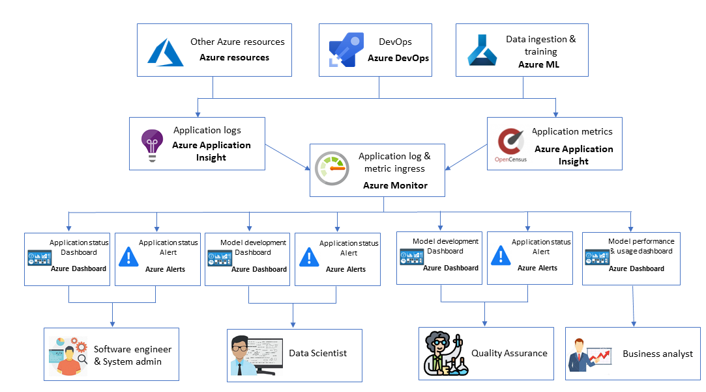

# Azure Resources and Azure Machine Learning Observability

You can collect logs and visualize Azure Resources for observability. In this documentation, we illustrate which option you can use to achieve project goal.

# Observability Architecture

Even though each team may have different access permission to each Azure resource and observability requirements, you can use same technology to collect logs, then customize the visualization and alerts for each team.

Customer may have their own tools for observabilty. In such case, you can consider log integration between Azure Monitor and their system.
___

# Azure Machine Learning project group types

Typically, there are at least four types of groups in Machine Learning projects. Each team have different requirements for observability.

- Software Engineer
- Data Scientist
- Quality Assuarance
- Business Analyst

## Software Engineer

SE typically works on entire sysetm and they will monitor application status using [Azure dashboard](https://docs.microsoft.com/en-us/azure/azure-monitor/learn/tutorial-app-dashboards), with alert.

- [Application logs](https://docs.microsoft.com/en-us/azure/azure-monitor/insights/insights-overview) and [system metrics](https://docs.microsoft.com/en-us/azure/azure-monitor/platform/data-platform#metrics) from all services are exported to [Azure Monitor](https://docs.microsoft.com/en-us/azure/azure-monitor/overview)
- Native Azure components export directly to Azure Monitor

## Data Scientist

Data Scientists uses Azure Machine Learning to build and publish models. They should have full access to Azure Machine Learning workspace with detail logs and charts. In addition, they will monitor Model Training and Evaluation results using Azure Dashboards, with alert.

- [Get context in Run environment](https://docs.microsoft.com/en-us/azure/machine-learning/how-to-train-with-datasets#directly-access-datasets-in-your-script) and [add ML train metrics to Application Insight telemetry](https://docs.microsoft.com/en-us/azure/machine-learning/how-to-debug-pipelines#logging-options-example)
- [Training Pipeline Metrics](https://docs.microsoft.com/en-us/azure/machine-learning/how-to-log-pipelines-application-insights) are exported Application Insights log or OpenCensus format

## Quality Assurance

Quality Assurance team may run the model performance test built by Data Scientist team by using different set of test dataset. You may want to restrict their access to Azure Machine Learning service so that they cannot see the code to build the model, as they just need to run the model accuracy tests. 

- Not see the details on Azure DevOps and Azure ML
- Run a performance experiment pipeline
- See experiment results on Azure Dashboard
- Receive notifications when experiment is started and ended

## Business Analyst

Business analyst will monitor Model Performance & [usage monitor](https://docs.microsoft.com/en-us/azure/azure-monitor/platform/usage-estimated-costs) by using Azure Dashboard using data sourced from Azure Monitor

___
# Observability Technical Resource

## Azure Monitor

- Azure Monitor maximizes the availability and performance of your applications and services by delivering a comprehensive solution for collecting, analyzing, and acting on telemetry from your cloud and on-premises environments
- https://docs.microsoft.com/en-us/azure/azure-monitor/overview

## Azure Application Insights

- Application Insights provide a customized monitoring experience for particular applications and services
- https://docs.microsoft.com/en-us/azure/azure-monitor/insights/insights-overview

## System Metrics

- Metrics are numerical values that describe some aspect of a system at a particular point in time. 
- https://docs.microsoft.com/en-us/azure/azure-monitor/platform/data-platform#metrics

## Azure Dashboard

- Azure Dashboards are a focused and organized view of your cloud resources in the Azure portal
- https://docs.microsoft.com/en-us/azure/azure-portal/azure-portal-dashboards
- https://docs.microsoft.com/en-us/azure/azure-monitor/learn/tutorial-app-dashboards

## Azure Alerts

- Alerts proactively notify you when issues are found with your infrastructure or application using your monitoring data in Azure Monitor
- https://docs.microsoft.com/en-us/azure/azure-monitor/platform/alerts-overview

## Prometheus Exposition format

- Metrics can be exposed to Prometheus using a simple text-based exposition format
- https://prometheus.io/docs/instrumenting/exposition_formats/

## AzureML Training pipeline metric

- Aggregating logs from AzureML training pipeline runs in one place allows you to build queries and diagnose issues
- https://docs.microsoft.com/en-us/azure/machine-learning/how-to-log-pipelines-application-insights

## AzureML Run context logging

- In compute cluster run environments, collect logging with run context
- https://docs.microsoft.com/en-us/azure/machine-learning/how-to-debug-pipelines#logging-options-example
