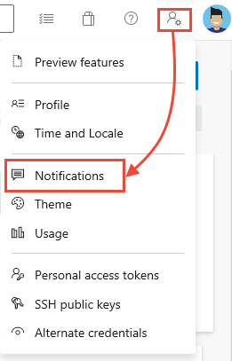
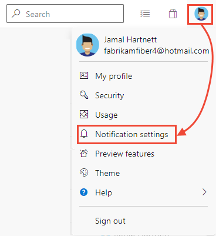
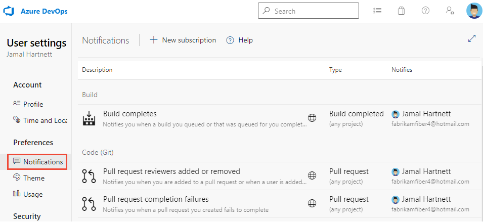
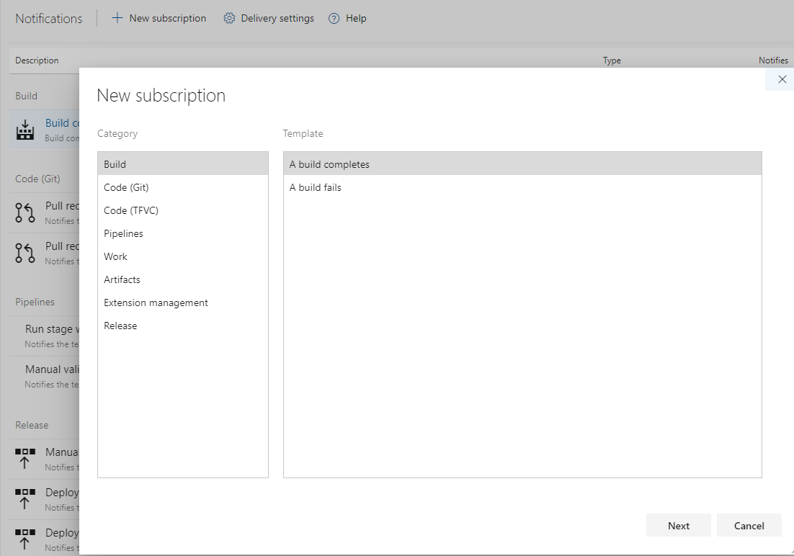

# Notification - Azure DevOps, Azure Machine Learning, and Cost Management

This document provides a short summary on setting up notifications in Azure.

## Notification

|Who|What|Where|How|Related document|
|-|-|-|-|-|
|Software Engineer, System Admin, Data Scientist|Azure DevOps pipeline - Build completes - Pull request reviewers added or removed - Pull request changes|-email -Microsoft Teams -Slack|- email: Notifications setting in Azure DevOps (Personal, Team, Project, Global) - [Azure DevOps Pipelines with Microsoft Teams](https://docs.microsoft.com/en-us/azure/devops/pipelines/integrations/microsoft-teams?view=azure-devops) - [Azure DevOps Pipelines with Slack](https://docs.microsoft.com/en-us/azure/devops/pipelines/integrations/slack?view=azure-devops)|- Azure DevOps monitoring and notification (See the following section) - [Azure Pipelines with Microsoft Teams](https://docs.microsoft.com/en-us/azure/devops/pipelines/integrations/microsoft-teams?view=azure-devops)  - [Microsoft Teams - Azure Pipelines](https://appsource.microsoft.com/en/product/office/wa200000055?src=wnblogmar2018) - [Azure Pipelines with Slack](https://docs.microsoft.com/en-us/azure/devops/pipelines/integrations/slack?view=azure-devops)  - [Slack app - Azure Pipelines](https://slack.com/apps/AFH4Y66N9-azure-pipelines)|
|Data Scientist|Azure ML pipeline -Success/Failure|-email -Microsoft Teams -Slack|- StorageQueue + LogicApp - Directly set trigger with AML events e.g. LogicApp (See [document](https://docs.microsoft.com/en-us/azure/machine-learning/how-to-use-event-grid))|-|
|QA (Quality Assurance)|Azure ML pipeline - Start/End of experiments - Where the result is (i.e. Azure Dashboard)|-email -Microsoft Teams -Slack |- StorageQueue + LogicApp - Directly set trigger with AML events e.g. LogicApp (See [document](https://docs.microsoft.com/en-us/azure/machine-learning/how-to-use-event-grid)) *QA team does not have access to Azure DevOps and Azure ML|- [Trigger applications, processes, or CI/CD workflows based on Azure Machine Learning events (preview)](https://docs.microsoft.com/en-us/azure/machine-learning/how-to-use-event-grid)  - [Azure Machine Learning events (preview) section in Spike wiki - Notification](/Spikes/Notification)|
|Business Analyst|Cost management|-|- Azure Cost Management|[Azure Cost Management](https://docs.microsoft.com/en-us/azure/cost-management-billing/cost-management-billing-overview)|

## Azure DevOps monitoring and notification

### Personal

__Current Setting__
Open your profile menu, and choose Notifications,

Or Notification settings.

The profile menu appears as shown below based on whether the New Account Manager feature has been enabled or not.

### Team, Project

__Current Setting__
You can see the current **team or project level** notifications setting from Project Settings in Azure DevOps.

### Add new notifications

1. Click "New subscription" and select a templete

2. Input the detail and click "Finish"

### Deliver to individual members or specific email address

If you want to deliver not individual members but specific email address only, then you can change the delivery setting.

### Global

__Current Setting__
This Global setting is for both Language Model and Trigger Word projects.
Choose the Azure DevOps icon and then choose Global Notifications under Organization settings.

## Reference

- [About notifications](https://docs.microsoft.com/en-us/azure/devops/notifications/about-notifications?view=azure-devops)
- [Novigating the UI](https://docs.microsoft.com/en-us/azure/devops/notifications/navigating-the-ui?view=azure-devops)
- [Events and notifications](https://docs.microsoft.com/en-us/azure/devops/notifications/concepts-events-and-notifications?view=azure-devops)
- [How email recipients are determined](https://docs.microsoft.com/en-us/azure/devops/notifications/concepts-email-recipients?view=azure-devops)
- [Change your preferred email address](https://docs.microsoft.com/en-us/azure/devops/notifications/change-email-address?view=azure-devops&tabs=preview-page)
- [Manage personal notifications](https://docs.microsoft.com/en-us/azure/devops/notifications/manage-your-personal-notifications?view=azure-devops&tabs=preview-page)
- [Unsubscribe from default notification](https://docs.microsoft.com/en-us/azure/devops/notifications/unsubscribe-default-notification?view=azure-devops)
- [Manage team, group, and Global notifications](https://docs.microsoft.com/en-us/azure/devops/notifications/manage-team-group-global-organization-notifications?view=azure-devops)
- [Exclude your self from notification of events you initiated](https://docs.microsoft.com/en-us/azure/devops/notifications/exclude-self-from-email?view=azure-devops)
