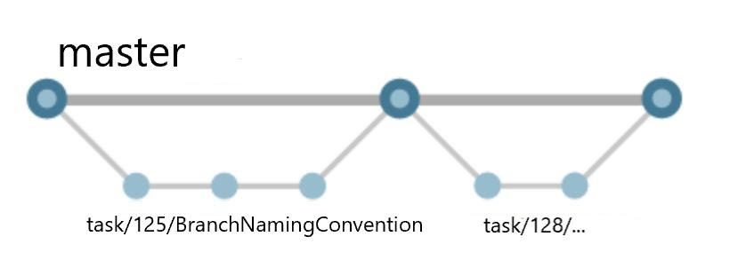

# Overview

**Branch Strategy for Issue** defines how should you create/maintain/merge a feature branch when a new task is assigned to you.  
A feature branch should be named as *your account*/*issue id*/*description*. Or in case you use Azure DevOps for manage tasks, task/*task id*/*description*.

## Branch Strategy for Tasks

If you use GitHub to manage issues, replace **task** to **issue**.

    

When you are assigned a new task:
1. Create a new feature branch to modify code.
    - Direct commit to main branch is **blocked**
    - The Feature branch should be named as:
      - task/*task id*/*description*. i.e., task/125/BranchNamingConvention
      - if you use github, then we recommend to use *your account*/*issue id*/*description*

When you finished code modification:

1. Create a pull request to merge the changes to main branch.
    - Clear title, and enough detail in the description 
    - At least **two** reviewer approvals are required
    - Successful build of CI pipeline is required if appricable. 
    - Link to related task id is required if appricable.
    
1. Keep a high quality, up-to-date main branch.
    - main branch should pass all tests
    - main branch should be built without error
    - About what is **high quality** code, please also refer to,
      - Microsoft CSE playbook [Eng Fundamentals Checklist](https://github.com/microsoft/code-with-engineering-playbook/blob/master/ENG-FUNDAMENTALS-CHECKLIST.md)
      
# References
[Azure DevOps - Branch Organization](https://docs.microsoft.com/en-us/azure/devops/repos/git/git-branching-guidance?view=azure-devops)
