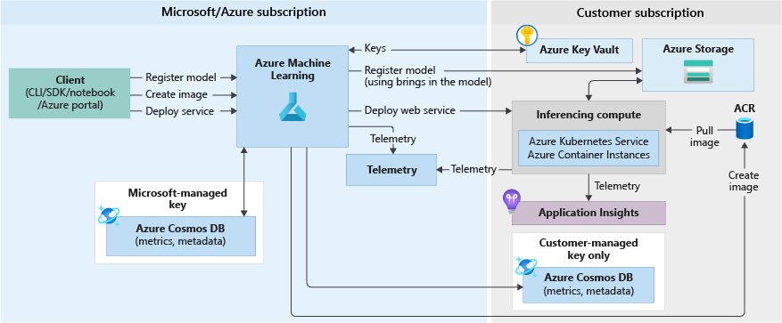

# Problem Statement

What are the security considerations to take into account when building a machine learning solution, especially if it's built on Azure Machine Learning Service (AML)? This article summerizes the key points that developers can act upon toward building a secure ML solution. For a complete guide, see this [Microsoft documentation](https://docs.microsoft.com/en-us/azure/machine-learning/concept-enterprise-security).

## Inside Azure ML

Azure ML is a Platform-as-a-Service (PAAS). As any PAAS, security is a shared responsibility between the customer and Microsoft.

When you deploy an AML Workspace, you not only provision resources required by AML in your own subscription, Microsoft also provisions resources for you in a Microsoft managed subscription. Depending on your security requirements, you can have different levels of control over these resources. The following diagrams from [AML documentation](https://docs.microsoft.com/en-us/azure/machine-learning/concept-azure-machine-learning-architecture) depict the resources deployed with an AML Workspace.

### AML Model Traing

### AML Model Inferencing

## Network Security

Take the following measures to secure your network and endpoints. You don’t have to implement all of them. For example, you can add your Storage account to a virtual network with a Service Endpoint without having to enable Private Link on your AML workspace.

1. Create a [Private Link-enabled Workspace](https://docs.microsoft.com/en-us/azure/machine-learning/how-to-secure-workspace-vnet#secure-the-workspace-with-private-endpoint) to enable communication between your VNet and the AML Workspace.

2. Add Azure Key Vault to the virtual network with a [Service Endpoint](https://docs.microsoft.com/en-us/azure/key-vault/general/overview-vnet-service-endpoints) or a [Private Endpoint](https://docs.microsoft.com/en-us/azure/key-vault/general/private-link-service). Set Key Vault to ["Allow trusted Microsoft services to bypass this firewall"](https://docs.microsoft.com/en-us/azure/machine-learning/how-to-secure-workspace-vnet#secure-azure-key-vault).

3. Add your Azure storage account to the virtual network with a [Service Endpoint](https://docs.microsoft.com/en-us/azure/machine-learning/how-to-secure-workspace-vnet#secure-azure-storage-accounts-with-service-endpoints) or a [Private Endpoint](https://docs.microsoft.com/en-us/azure/machine-learning/how-to-secure-workspace-vnet#secure-azure-storage-accounts-with-private-endpoints).

4. [Enable Azure Container Registry with AML in a virtual network](https://docs.microsoft.com/en-us/azure/machine-learning/how-to-secure-workspace-vnet#enable-azure-container-registry-acr) and [enable subnet delegation in Azure Container Instances](https://docs.microsoft.com/en-us/azure/machine-learning/how-to-secure-inferencing-vnet#enable-azure-container-instances-aci).

## Identity & Access Control

* AML Operations
  * [Assign user roles to perform specific AML operations](https://docs.microsoft.com/en-us/azure/machine-learning/concept-enterprise-security#restrict-access-to-resources-and-operations)
  * [Use MSI to pull docker images from ACR to compute clusters](https://docs.microsoft.com/en-us/azure/machine-learning/how-to-use-managed-identities?tabs=python) so no ACR admin passwords need to be stored (in preview)
* Data
  * [Use Azure AD authentication whenever possible](https://docs.microsoft.com/en-us/azure/storage/common/storage-auth-aad?toc=/azure/storage/blobs/toc.json)
  * Storage Account/Container/FileSystem level access (Blob Storage or ADLS Gen2)
    * Assign least privileges ([roles](https://docs.microsoft.com/en-us/azure/storage/common/storage-auth-aad?toc=/azure/storage/blobs/toc.json#azure-built-in-roles-for-blobs-and-queues) and [scopes](https://docs.microsoft.com/en-us/azure/storage/common/storage-auth-aad?toc=/azure/storage/blobs/toc.json#resource-scope)) for users to access data (data plane)
    * Assign least privileges for users to [manage data](https://docs.microsoft.com/en-us/azure/storage/common/authorization-resource-provider?toc=/azure/storage/blobs/toc.json#built-in-roles-for-management-operations) (control plane)
  * Folder/File level access (ADLS Gen2 only)
    * Always use Azure AD security groups rather than individual users in [ACL](https://docs.microsoft.com/en-us/azure/storage/blobs/data-lake-storage-access-control-model#access-control-lists-acls)
* Create different AML Workspaces for dev/test/staging/prod environments and assign privileges accordingly
* Azure DevOps
  * [Set appropriate project visibility](https://docs.microsoft.com/en-us/azure/devops/organizations/public/make-project-public?view=azure-devops) – private, enterprise, or public
  * Assign permissions to users or teams at [organization](https://docs.microsoft.com/en-us/azure/devops/organizations/security/permissions?view=azure-devops&tabs=preview-page#organization-level-permissions), [project](https://docs.microsoft.com/en-us/azure/devops/organizations/security/permissions?view=azure-devops&tabs=preview-page#project-level-permissions), and [repository](https://docs.microsoft.com/en-us/azure/devops/organizations/security/permissions?view=azure-devops&tabs=preview-page#git-repository-object-level) levels
  * [Add users to a role for role based access](https://docs.microsoft.com/en-us/azure/devops/organizations/security/about-security-roles?view=azure-devops) such as Service Connection, Variable Groups, and Agent Pools
  * Avoid having secrets as much as possible. Nothing is more secure than no secrets at all. If you must, store secret variables in Azure Key Vault instead of Azure DevOps.  Not only it's more secure, ML pipelines can also be triggered outside Azure DevOps by users who have access to secrets, for example, from their dev machines.
  * Run [Microsoft Security Code Analysis](https://secdevtools.azurewebsites.net/) in Azure DevOps.

## Information Protection

* Enable [Container Registry Vulnerability Scanning](https://docs.microsoft.com/en-us/azure/security-center/defender-for-container-registries-introduction) to ensure Docker images are clear of malicious components
* Encryption –
  * For production grade encryption, use AML Compute cluster for training, and AKS for inferencing. AML Compute Instance is for dev/test
  * Turn on [hbi_workspace](https://docs.microsoft.com/en-us/azure/machine-learning/concept-data-encryption#encryption-at-rest) flag for workspace that contains sensitive data
  * You can use CMK (Customer Managed Key) for encryption in the following AML services
    * Azure Storage
    * Azure Cosmos DB (create your own)
    * Azure Container Registry (create your own)
    * Azure Container Instance
    * Azure Kubernetes Service
* Logging –
  * Don’t store sensitive data in environment variables – environment variables are logged, encrypted and stored by Microsoft
  * Don’t put sensitive data in run_id
  * Don’t put sensitive data in application logs
* Auditing & Compliance
  * [Manage data lifecycle with policies](https://docs.microsoft.com/en-us/azure/storage/blobs/storage-lifecycle-management-concepts?tabs=template#add-or-remove-a-policy) (ex. delete data after N days)
    * To manage the data in AML owned storage containers, you can set [lifecycle actions based on the age](https://docs.microsoft.com/en-us/azure/storage/blobs/storage-lifecycle-management-concepts?tabs=template#rule-actions) of data, ex. N days after modification or creation or access.
  * [Enforce security policy on AML](https://github.com/Azure/azure-policy/tree/master/built-in-policies/policyDefinitions/Machine%20Learning)

    

  * Enable [Azure Storage diagnostics](https://docs.microsoft.com/en-us/azure/storage/blobs/monitor-blob-storage?tabs=azure-portal#creating-a-diagnostic-setting) to audit storage access. This is what [a sample log entry](https://docs.microsoft.com/en-us/azure/storage/blobs/monitor-blob-storage-reference#fields-that-describe-the-operation) looks like.

    

## Threats Unique to Machine Learning

 Production deployments of machine learning solutions in enterprises are still fairly new and few, awareness and understanding of ML security risks are low. Full discussion of ML security risks is out of the scope of this doc, however, here are some examples for raising awareness:

* An attacker could poison training and testing data, for example, a chatbot trained on publicly available data can be poisoned with offensive content.
* An attacker can temper the model algorithm, for example, a self-driving car can be tricked to determine a dangerous area is safe to drive when the weakness in its vision model is exploited.

Make sure to analyze the risks and impact in case your ML solution is compromised. Mitigate as much as you can, and have a response plan.

## References

* Enterprise security and governance for Azure Machine Learning: <https://docs.microsoft.com/en-us/azure/machine-learning/concept-enterprise-security>.
* Security how-tos: <https://docs.microsoft.com/en-us/azure/machine-learning/how-to-setup-authentication>.
* You can check all the Azure roles a Service Principal has by running `az role assignment list --assignee <app_id_or_object_id> --all --include-inherited`.
