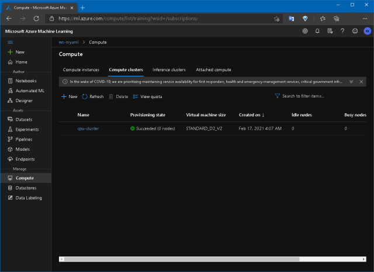

# Overview

This is a sample that guides you through the basic works to use your own machine learning code with Azure ML Pipeline.

## Background

Here is a virtual scenario. You have a simple diabetes linear regression code using Scikit-learn.

> Linear Regression Example: https://scikit-learn.org/stable/auto_examples/linear_model/plot_ols.html

- How can I use it with Azure ML?
- What should we do for MLOPS?

We will guide you in a very basic way here.

# Getting Started

## Prerequisite
- Install Visual Studio Code: https://code.visualstudio.com
- Install Docker: https://www.docker.com
- Register Azure account: https://azure.microsoft.com/free

## Step 0. Setup dev environment

- git clone this repo
- Open vscode in dev container
  
  > The first run can take a long time because it builds docker images.

  Then open the terminal and do the following:

- Install the Azure CLI - [read more...](https://docs.microsoft.com/cli/azure/install-azure-cli-linux?pivots=apt)
  
  ```bash
  $ curl -sL https://aka.ms/InstallAzureCLIDeb | sudo bash
  ```
  
- Sign in to Azure with the Azure CLI - [read more...](https://docs.microsoft.com/cli/azure/install-azure-cli-linux?pivots=apt#sign-in-to-azure-with-the-azure-cli)

  ```bash
  $ az login
  ```

  > If you have multiple subscriptions, check and set your subscriptions id.
  > ```bash
  > $ az account list -o table
  > $ az account set -s [Your subscription Id]
  > ```

- Install Conda dependencies

  > If you want to print the conda env name at the prompt...
  > ```bash
  > $ conda init zsh && zsh 
  > ```
  ```bash
  $ conda env create --file environment_setup/conda_dependencies.yml
  $ conda activate my_conda
  ```

- Create Azure ML workspace with Python - [read more...](https://docs.microsoft.com/azure/machine-learning/how-to-manage-workspace?tabs=python#create-a-workspace)

  ```bash
  # Rename /.env.example to /.env
  # Set your SUBSCRIPTION_ID in the file
  $ python -m environment_setup.provisioning.create_workspace
  ```
  > Created in about 30 seconds.

- Create Compute cluster with Python

  ```bash
  $ python -m environment_setup.provisioning.create_compute
  ```

- Let's go to your Azure ML workspace!

  Go to https://ml.azure.com/ or you can access through https://portal.azure.com.

  

  Check your compute cluster
  
  


## Step 1. Run your train.py

As mentioned earlier, you have a simple diabetes Linear regression code using Scikit-learn. First, let's check if this code works properly in your local environment.

```bash
$ python -m src.train
Mean squared error:  4150.680189329983
Coefficient of determination:  0.19057346847560164
```

When finished, you can see the metrics and have *sklearn_regression_model.pkl* file and *fig.png* graph image in *outputs* folder.


## Step 2. Split your train.py into steps

From now on, the long journey to make your code the MLOps begins. The first is to split your code. Your code works well with single file, but you need to fragment it for MLOps implementation.


It's up to you to decide how many to split! But now... let's break down into 3 steps: Data Preparation, Train, Register Model. The results of this are in the *src/steps* folder.

- *src/steps/01_prep_data.py*

  > Gets the diabetes data, makes it as X, y, and places only one feature in X.

- *src/steps/02_train.py*

  > Perform the training, print the results (mse, r2score, matplot image) and generate the model.

- *src/steps/03_reg_model.py*

  > Register the model file with Azure ML workspace.

> Most works are to handle parameters with *argparse* and leave logs via *Run.get_context()*. Of course, there's a lot of work to do to use advanced features!

Then, You can test if the codes above are running well in your local environment.

```bash
$ python -m src.steps.01_prep_data \
    --data_X=outputs/diabetes_X.csv \
    --data_y=outputs/diabetes_y.csv
$ python -m src.steps.02_train \
    --data_X=outputs/diabetes_X.csv \
    --data_y=outputs/diabetes_y.csv \
    --model_dir=outputs \
    --model_name=model.pkl \
    --test_size=0.2
$ python -m src.steps.03_reg_model \
    --model_dir=outputs \
    --model_name=model.pkl
```

Once the csv files, graph file, and pkl file are all created in the outputs folder, you can see that they ran normally!

## Step 3. Run steps with AML

Now let's make sure this code works in Azure. Before set up the MLOps pipeline, it needs to individually test whether if your code works normally in Azure ML.

```bash
$ python -m ml_service.run_local_compute
```

The above is to ensure that only the *src/steps/01_prep_data.py* file is executed through the AML Workspace. This can be done if you want to run a single python file in AML, without the need for MLOps Pipeline.

```python
...
config = ScriptRunConfig(source_directory='src/steps',
                         script='01_prep_data.py',
                         compute_target='local',  # or 'cpu-cluster'
                         arguments=[
                                '--data_X', 'outputs/diabetes_X2.csv',
                                '--data_y', 'outputs/diabetes_y2.csv'
                         ],
                         environment=environment)
...
```

This code is also set to `compute_target='local'`  so the compute uses your local computer.

> The result files such as *'outputs/diabetes_X2.csv* and *'outputs/diabetes_y2.csv* will remain in the */tmp/azuremk_runs* folder of your local computer.

> If you set `compute_target='cpu-cluster'`, it will run on the compute cluster you created above. The first run requires time to be provisioned. (You will be charged as much as the running time!)

This process can step by step to check if your code works well on Azure ML.

## Step 4. Make MLOps pipeline

Now it's time to create a pipeline. Let's look around the code. */ml_service/pipelines/build_pipeline.py* is a script that builds the AML pipeline.

```python
...
    environment = Environment(name=env.aml_environment_name)
    environment.docker.enabled = True
    environment.docker.base_image = DEFAULT_CPU_IMAGE
    environment.python.user_managed_dependencies = False
    environment.python.conda_dependencies = CondaDependencies(conda_dependencies_file_path="./environment_setup/conda_dependencies.yml")
...
```

The above code defines the environment in which each pipeline step runs. This is where you configure your custom conda environment using the built-in CPU Docker Image. You can also use custom docker images from *Azure Container Registry* or *Docker Hub*.

```python
...
    # Create Pipeline data & parameters
    ds = ws.get_default_datastore()
    data_X = PipelineData('data_X', datastore=ds).as_dataset()
    data_y = PipelineData('data_y', datastore=ds).as_dataset()
    model_dir = PipelineData('model_dir', datastore=ds)
    pipeparam_test_size = PipelineParameter(name="pipeparam_test_size", default_value=0.2)
...
```

The above code creates *PipelineData* that transfers data between Pipeline Steps. And *PipelineParameter* can give variables whenever you run the pipeline.


Next, create each step.

```python
...
step2 = PythonScriptStep(
        name="train",
        compute_target=env.aml_compute_name,
        source_directory='src/steps',
        script_name='02_train.py',
        inputs=[data_X, data_y],
        outputs=[model_dir],
        arguments=[
            '--data_X', data_X,
            '--data_y', data_y,
            '--model_dir', model_dir,
            '--model_name', env.aml_model_name,
            '--test_size', pipeparam_test_size
        ],
        runconfig=run_config,
        allow_reuse=False
    )
...
```

> Isn't it similar to the ml_service/run_local_compute.py file above? *PipelineStep* can be connected to each step, but *ScriptRunConfig* can only run a single file. In addition, *PipelineStep* cannot use `compute_targert='local'`, but *ScriptRunConfig* is possible. 
>
> Therefore, going to *PipelineStep* after working enough with *ScriptRunConfig* in your local environment saves time and money!

Because each step is connected by *inputs* and *outputs*, all steps are automatically added to the pipeline even if only one of the steps is added.

```python
...
	# Build pipeline
    pipeline = Pipeline(workspace=ws, steps=[step3])
    pipeline.validate()
...
```

Publish your pipeline and add it to *PipelineEndpoint* and publish it.

```python
...
# Publish pipeline & pipeline_endpoint
    published_pipeline = pipeline.publish(name=env.aml_pipeline_name)

    try:
        pipeline_endpoint = PipelineEndpoint.get(workspace=ws, name=env.aml_pipeline_endpoint_name)
        pipeline_endpoint.add_default(published_pipeline)
    except ErrorResponseException:
        pipeline_endpoint = PipelineEndpoint.publish(workspace=ws, name=env.aml_pipeline_endpoint_name, description=env.aml_pipeline_endpoint_name, pipeline=published_pipeline)
...
```

> *PipelineEndpoint* is an object that integrates multiple pipelines.  Allows you to manage the version of the pipelines and call the latest version of the pipeline with a single REST API address.

Now let's build the pipeline.

```bash
$ python -m ml_service.pipelines.build_pipeline
```

Go to the Azure ML workspace portal to see that the pipeline has been created.


## Step 5. Run MLOps pipeline

Lastly, let's run the published pipeline.

```bash
$ python -m ml_service.pipelines.run_pipeline --test_size=0.2
```

You can give the parameters when you run the pipeline. When you execute the code above, you can get a link to the Azure ML Workspace and go to the link to see the progress of the pipeline.

> Provisioning might take some time if the cpu-cluster is not provisioned!

If it runs well, you can see that each step is running normally as follows:


You can view the log results at each step.


You can get the latest model.


# Conclusion

I introduced the process of moving your existing code to Azure ML Pipeline. This is just the beginning and the most basic step to realize the AML Pipeline.
Now it's time to make your own MLOps according to your needs. Good luck!


# References

- https://azure.github.io/azureml-examples/
- https://docs.microsoft.com/azure/machine-learning/how-to-create-machine-learning-pipelines
- https://github.com/microsoft/MLOpsPython
- https://github.com/Azure/MachineLearningNotebooks/blob/master/how-to-use-azureml/machine-learning-pipelines/intro-to-pipelines/aml-pipelines-getting-started.ipynb