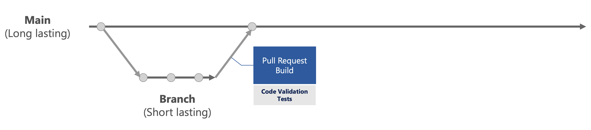
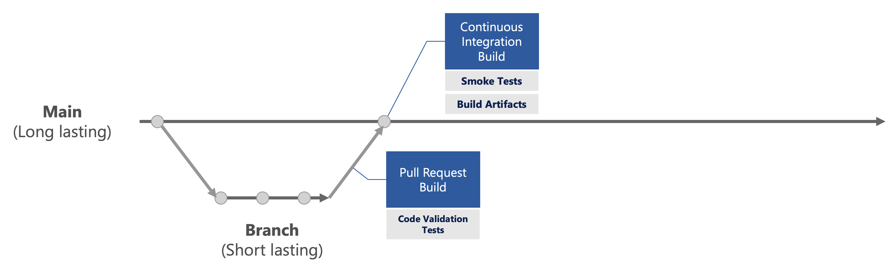
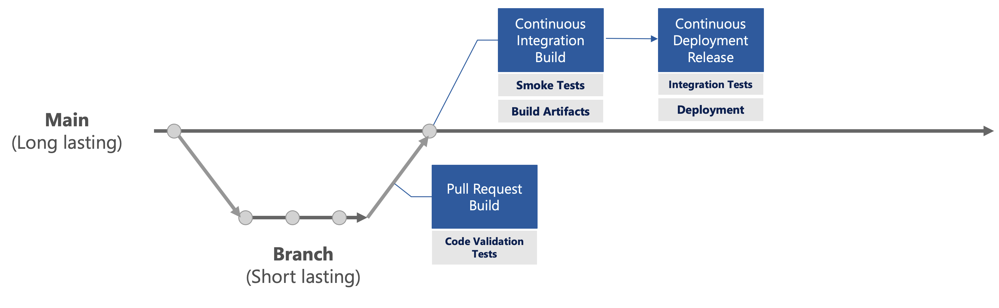

# DevOps Fundamentals <!-- omit in toc -->

The goal of this document is to describe the fundamentals for DevOps for an MLOps project.

## Sections <!-- omit in toc -->

- [Pull Request Pipeline](#pull-request-pipeline)
- [Continuous Integration (CI)](#continuous-integration-ci)
- [Continuous Delivery (CD)](#continuous-delivery-cd)
- [Creating DevOps Pipelines](#creating-devops-pipelines)
- [Tips](#tips)
  - [How To Validate Trigger Changes in Yaml](#how-to-validate-trigger-changes-in-yaml)
- [Issues](#issues)
  - [Yaml Path Filter Does Not Support Wildcard](#yaml-path-filter-does-not-support-wildcard)
- [References](#references)

## Pull Request Pipeline

When a developer has completed her code change in the feature branch, she will send out a pull request (PR) for review. Once the PR is
created, a PR pipeline will be triggered. The purpose of this PR pipeline is to run code validation tests to ensure the quality of the
code. The code validation tests include:

| Task | Description | Will this fail PR pipeline? |
| ---- | ----------- | --------------------------- |
| Build solution | This ensures that there is no build break. | YES |
| Run unit tests | This ensures that individual units of source code are tested. Unit tests will be added alongside new features added to the code base.  | YES |
| Run code quality tests | This ensures the code remains high quality. This includes linting, code defect validation, etc.  | YES |
| Run code coverage | This describes the degree to which the source code is tested with our test suites.  | NO |



## Continuous Integration (CI)

Once the PR is reviewed with code validation tests passed and completed, then the continuous integration (CI) pipeline is run.
The purpose of this CI pipeline is to:

- *Revalidate the quality of the code after merging into main* - Run the same code validation tests as the PR pipeline
- *Validate the integrated functionalities* - Run a minimum set of the integration tests and a full set of contract tests
- *Collect artifacts to be deployed to production* - This can be achieved through Azure DevOps artifacts such as binaries for deployment
and scripts to train a model in Azure ML or pushing a container into Azure Container Registry (ACR).



## Continuous Delivery (CD)

Once the CI pipeline has executed successfully, it will then trigger a continuous delivery (CD) pipeline to run. The purpose of this CD
pipeline is to:

- *Validate the end-to-end functionalities* - Run end-to-end tests with collected artifacts
- *Deploy validated artifacts* - Once all the validation is completed and approval obtained from dedicated approvers,
the collected artifacts will then be deployed according to its branch's destination (ie: main is for dev environment and release is
for production).



## Creating DevOps Pipelines

For this sample project, all of our DevOps pipelines will be developed with yaml files and checked-in into `.pipelines` folder.
In this `.pipelines` folder, it will contain a yaml file per pipeline. Any sharable code between the pipelines will be separated into
templates inside the `templates` folder.

Here is an example to illustrate the `.pipelines` folders setup:

``` text
├── .pipelines
│   ├── templates
│   │   ├── template-*.yml
│   ├── ci-*.yml
│   ├── cd-*.yml
└──-└── pr-*.yml
```

To learn how to create DevOps pipeline with yaml, please watch the below video:

[](https://www.youtube.com/watch?v=NuYDAs3kNV8)

## Tips

Here are some tips for developing CI/CD pipelines.

### How To Validate Trigger Changes in Yaml

Often, when developing a Yaml file for a pipeline, branch trigger will be set to an actual long-lasting branch such as `main`
and / or `release`, such as the following:

```yaml
trigger:
  branches:
    include:
    - main
    - release
```

However, validating the above trigger before merging the PR is difficult (as both `main` and `release` branches are locked).
Thus, an easier way to validating changes is the following:

1. Add feature branch to the Yaml file as filter, comment out or remove the `main` and `release` branches, then commit the changes.

    ```yaml
    trigger:
      branches:
        include:
        # - main
        # - release
        - alias/feature-branch
    ```

1. Create a new temporary DevOps pipeline and set `Get Source` to be the Yaml file in the feature branch. Then save changes to take effect.

1. Push changes in the feature branch to validate triggers in the temporary DevOps pipeline.

Once the validation is completed, **remember** to revert the branch filter to the originally intended branches
(`main` and / or `release`), and delete the temporary DevOps pipeline for good measures.

## Issues

Here are some issues found when developing CI/CD pipelines.

### Yaml Path Filter Does Not Support Wildcard

[Wildcard](https://docs.microsoft.com/en-us/azure/devops/pipelines/tasks/file-matching-patterns?view=azure-devops#recursive-wildcard-examples)
Yaml path filter is not currently supported as described by [Path filters wildcard support](https://github.com/MicrosoftDocs/azure-devops-docs/issues/397).

For example, a path trigger to run with all `*.md` file changes will **not work** with the following syntax:

```yaml
trigger:
  branches:
    include:
    - some-branch
  paths:
    include:
    - '**/*.md'
```

The issue is raised within the Developer Community's post [Support wildcards (*) in Trigger > Path Filters](https://developercommunity.visualstudio.com/idea/366363/support-wildcards-in-trigger-path-filters-1.html).

## References

- [Build Python Apps with DevOps Pipelines](https://docs.microsoft.com/en-us/azure/devops/pipelines/ecosystems/python?view=azure-devops)
- [Continuous Integration](https://github.com/microsoft/code-with-engineering-playbook/tree/master/continuous-integration)
- [Continuous Delivery](https://github.com/microsoft/code-with-engineering-playbook/tree/master/continuous-delivery)
- [YAML schema reference](https://docs.microsoft.com/en-us/azure/devops/pipelines/yaml-schema?view=azure-devops&tabs=schema%2Cparameter-schema)
