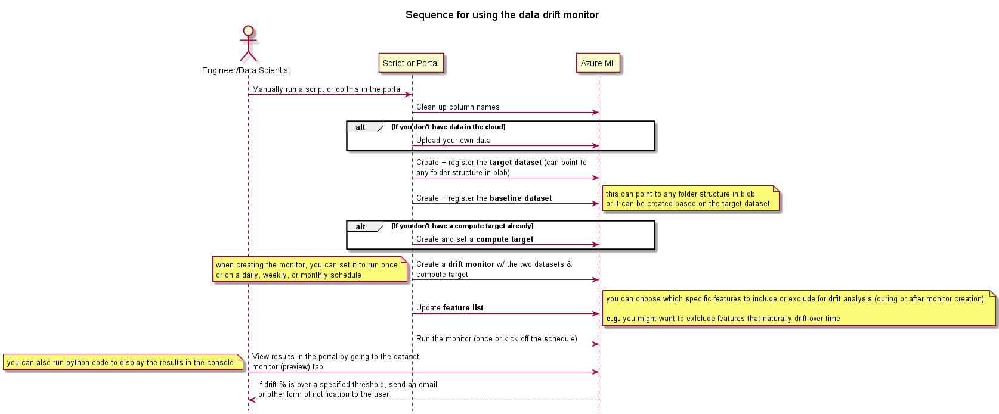

# Data Drift Architecture

## Goal

Data drift is the change in model input data that leads to model performance degradation.
Monitoring data drift helps detect these model performance issues.

We can run the drift either on a schedule, or as part of a pipeline job on data partitioned by day, week, month or on a batch by batch basis.

If we encounter drift and it passes a certain threshold, we want to be able to get an email or other notification.

For this sample project, we will focus on setting up a drift monitor through a script.
If we want model re-training to be triggered based on the threshold,
we'll have to implement that later.

For this proof of concept, we will be using the built-in **AML Dataset Monitor (preview)** that can automatically
run a drift analysis on any two datasets that you have.

Once you set a **baseline dataset** (usually the training dataset
for a model)
and a **target dataset** (usually model input data - is compared over time to your baseline dataset),
the monitor runs a job (one time or scheduled) to check for drift.

This method can be implemented through **code** or through the **UI**.

## Sequence Diagram

Due to the nature of the features/columns in our data, the engineers who need this drift feature will need to have it
customized since the monitor is sensitive and catches some drift which may or not be expected for certain features.

Here is a simple sequence diagram to show the general flow for creating a drift monitor:


## Creating a drift monitor

You can create a drift monitor through the Azure ML Studio or through code.

If you want to do either, [here is the
official documentation.](https://docs.microsoft.com/en-us/azure/machine-learning/how-to-monitor-datasets?tabs=python)

It thoroughly goes through how to set up each dataset and create a monitor with both code + the portal.
You'll need:

- An Azure Subscription
- An AML learning workspace
- The AML SDK for Python
- Sample data (or real data)

We have investigation notebooks with sample code in our *spikes* folder if you need more tutorials.

- [datadrift-tutorial.ipynb](./spike_scripts/datadrift-tutorial.ipynb) uses one data table
as both the baseline + target dataset. It uses `baseline=target.time_before(datetime(YYYY, MM, DD))`
to create two datasets.
- [data-set-drift.ipynb](./spike_scripts/data-set-drift.ipynb) creates multi-week data that drifts over time. It's baseline is our
  current sample data and its target is six new weeks of data with drift applied to certain features.
- [data-prep.ipynb](./spike_scripts/data-prep.ipynb) cleans the feature names
  prior to creating a monitor, which helps accuracy.

## Running the data drift script

The data drift script lives in the [aml repository](./../aml/data-drift.py) and isn't connected to CI/CD or any automated process.

The script creates a target and baseline dataset and deploys a dataset monitor with those datasets. It then runs a backfill job.

You must provide a target dataset variable in your `.env` which points
to the data you will be uploading to.

You can also give a baseline path to create the baseline dataset from, but you can also leave that variable empty (use an empty string)
and the code will automatically create a baseline dataset from the target dataset based data from 30 days ago (you can modify this number).

1. To manually run the data drift script, follow the first four steps of
[running the model](../docs/development/local-env-setup.md) and install the necessary
requirements for the AML folder.
1. Once you have an environment with the necessary requirements that can run the python code, you'll need to create a local `.env`.
Use the sample `.env` below you can just update the variables to match where
you are running the drift monitor.
1. Once your virtual environment and your `.env` has been set up, you can just run the command below in a terminal
(while in the aml folder) and it'll run the script.

  ```cmd
  python -m data-drift
  ```

Wait for the monitor to run the backfill (3-5 minutes), and it will display the results.

### Notes

- You can run this script anywhere as long as you have a correct `.env`. So if your local python env is running into network
issues, you can also deploy a compute instance on Azure ML clone the repo and run the
`data-drift.py` code from there.

- Note: If you have already run any of the AML code locally, you should already have created a `.env` file.
In that case, you can just use the same `.env` since they're the exact same.

### Notes on Data

- If you already have data in a specified format in blob, such as `*/<plant>/<line>/yyyy/mm/dd`, you can just register
that data as a baseline and/or a target.
  - The monitor only need two datasets, with whatever partition format, and it can run the drift algorithm.

- The drift monitor has a hard time figuring out the column names so you'll need to strip the names of special characters
  (e.g. `()` and `&`).
  - We have [sample code](./spike_scripts/data-prep.ipynb)
  in our spikes folder on how to do this.

- For the purposes of this project, we will want to run a backfill job to start, and if the features look good, then we can
  create a scheduled monitor run and point it to where our true data lives.
  - Once we've figured out our data science needs, we can inject the script that creates the monitor + two datasets into whichever pipeline
  or code segment we want.

### Sample Environment variables

```dotenv
SUBSCRIPTION_ID=<Azure Subscription Id>
WORKSPACE_RESOURCE_GROUP=<Workspace RG>
DATASTORE_RESOURCE_GROUP=<Datastore RG>
AAD_TENANT_ID=<AAD Tenant ID>
AAD_SERVICE_PRINCIPAL_ID=<AAD SP ID>
AAD_SERVICE_PRINCIPAL_SECRET=<AAD SP Secret>
WORKSPACE_NAME=<Workspace Name>
COMPUTE_TARGET_NAME=<Compute Target Name>
DATASTORE_NAME=<Datastore Name>
DATASTORE_CONTAINER_NAME=<Container Name>
ENVIRONMENT_NAME=AzureML-sklearn-0.24-ubuntu18.04-py37-cuda11-gpu
ENVIRONMENT_VERSION=1
ENVIRONMENT_BASE_IMAGE=mcr.microsoft.com/azureml/sklearn-0.24.1-ubuntu18.04-py37-cpu-inference:latest
DATA_STORAGE_ACCOUNT_NAME=<Account Name>
DATA_STORAGE_ACCOUNT_KEY=<Account Key>
```
