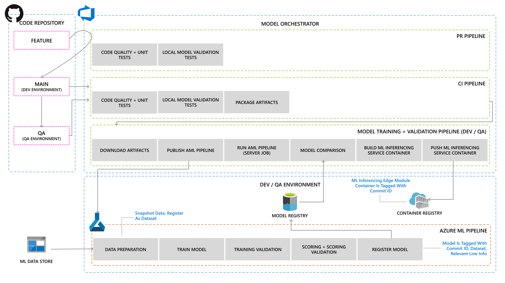
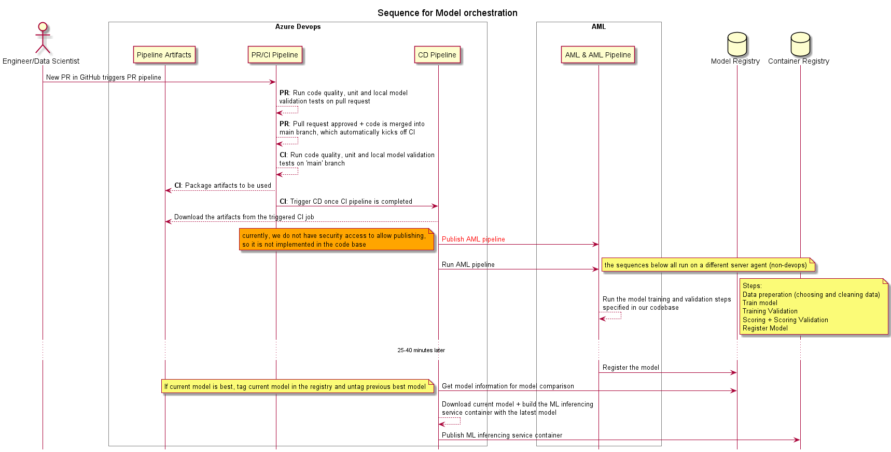

# Model Orchestration <!-- omit in toc -->

This design document illustrates the Model Orchestration workstream within the ML workload.

## Sections <!-- omit in toc -->

- [Overview](#overview)
- [Model Orchestration Workstream](#model-orchestration-workstream)

## Overview

The MLOps workload's Model Orchestration workstream leverages Azure DevOps as the **Model Orchestrator** and Azure ML as the
**Machine Learning Service**. Model orchestrator handles all orchestration needs, including publishing and triggering ML pipelines
whereas the Machine learning service only focuses on running the ML pipelines to train, score, validate, and register the trained model.

The responsibilities of the Model orchestrator are 3 fold:

1. Code validation: Leverage the [best practices of DevOps](./../development/devops-fundamentals.md) to handle model and Azure ML pipeline
code changes.

1. Model training and validation: Publish and trigger model training and validation with Azure ML pipeline.

1. Inferencing service packaging and validation: Package the inference service container and validate basic functionality with the latest
trained model.

## Model Orchestration Workstream

The model orchestration workflow is built with 4 pipelines for each model type. Thus, it is important to modularize any shareable code
to reduce code duplication.

1. **Azure Pipeline** - PR & CI: PR and CI Azure pipelines for model orchestration will be triggered by any model code changes within
the `mlops` folder. The main purpose of these pipelines is to validate the productionalized model code, run model validation tests, and
collect artifacts to train and validate model with ML service (CI only). For more information, please visit [ML PR & CI Pipelines](./pipelines/pr-ci-ml-pipeline.md).

1. **Azure Pipeline** - Model Training and Validation (CD - ML): Model training and validation Azure pipeline will be triggered
 after the CI
pipeline is completed. This pipeline can also be triggered manually after establishing an updated training and validation dataset that
reflects the change to material or equipment. Another potential trigger can be data drift detection. The main purpose of this pipeline
is to publish and run the ML pipeline, ensure that the latest changed model is best, and build and publish the ML inferencing service
container with the latest model. For more information, please visit [ML model training and validation (CD) Pipeline](./pipelines/cd-ml-pipeline.md).

1. **Azure ML Pipeline**: ML pipeline will be triggered by the Model Training and Validation (CD) pipeline with serverless job. The
main purpose of this pipeline is to run all ML related tasks from data preparation, model training + validation, scoring + validation,
and register model with proper properties and tags. For more information, please visit [Azure Machine Learning Pipeline](./pipelines/aml-pipeline.md).

Here is a sequence diagram for the steps above:

