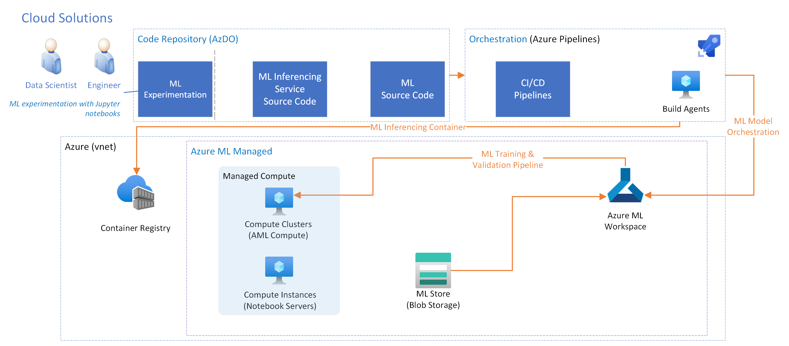

# Machine Learning Workload Architecture <!-- omit in toc -->

This design document illustrates the Machine Learning workload architecture of an IIOT project.

## Sections <!-- omit in toc -->

- [Overview](#overview)
  - [Experimentation](#experimentation)
  - [Model Orchestration](#model-orchestration)
  - [ML Inferencing Service](#ml-inferencing-service)
- [Solution Architecture](#solution-architecture)

## Overview

Machine learning (ML) is one of the core workloads within the overall Enterprise Industrial IoT solution. The scope of this workload spans

1. Ingesting ML required datasets from data uploads in manufacturing plants.
1. Running ML experimentation to determine the best architecture
with which to train a model
1. Training production models in the cloud by leveraging the best practices of MLOps
1. Building ML inferencing service
containers for the edge deployment to actual manufacturing plants.

### Experimentation

One of the biggest challenges with ML projects is the difference in mindset during the experimentation phase and the
production (operationalization) phase. Experimental phase is meant to run fast and experiment with data to prove the hypothesis.
Production phase is focused on applying the best practices of DevOps to ensure that the proper processes, validation, and approval gates
are leveraged before any ML model is used in production.

Roughly, the data science lifecycle can be illustrated with the following workstreams:

1. Experimentation workstream: Data Scientists will continue their experimentation using Jupyter Notebooks with Azure ML on the dev
environment. The result of the Jupyter Notebook can follow proper PR processes to be reviewed by the team and merged into the main
branch of the repo to be served as documentation.

1. Production workstream: Once the experimentation is approved and ready to be operationalized, the model code will be extracted into
Python modules to take advantage of MLOps. Then, the data scientist will implement the proper validation for the new changes to
be validated with [model orchestration workflow](#model-orchestration).

### Model Orchestration

The main purpose of the model orchestration (DevOps in this case) is to leverage the best practices of DevOps to operationalize ML
models. The main component of the workflow is the model orchestrator, which will leverage proper PR and CI pipelines to validate code
quality, and release pipelines to train and validate the model on machine learning service.

### ML Inferencing Service

The main purpose for the ML inferencing service is to run the best trained ML model from the cloud on the edge of the plants. For
more information, please refer to [Inferencing Container](../grpc_inferencing_service/README.md).

## Solution Architecture

1. Code Repository: Data scientists experiment with Jupyter notebooks and add their findings into the code repository for documentation
and review.

1. Code Repository: Once the experimentation code is ready for production, the ML code will then be extracted into proper modules
to be operationalized by Model Orchestration.

1. Model Orchestration: Once the production ML code is ready for review, Orchestrator will validate the code quality, package the required
artifacts, then train and validate the model with the machine learning service.

1. Model Orchestration: The Orchestrator is also responsible for ensuring that the latest model has the best model performance before
it containerizes the model with the ML inferencing service and push to the Edge workload registry.

1. Edge: The Enterprise Industrial IoT solution will be responsible for deploying and running the ML inferencing service container and extract
ML dataset from the plants to the cloud.
