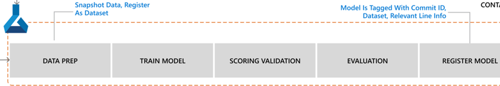

# Azure Machine Learning Pipeline <!-- omit in toc -->

This doc will go through the Azure Machine Learning Pipeline. This pipeline is kicked off from Azure DevOps as a [Server Job](https://docs.microsoft.com/en-us/azure/devops/pipelines/yaml-schema?view=azure-devops&tabs=schema%2Cparameter-schema#server)
with a [Run published pipeline task](https://marketplace.visualstudio.com/items?itemName=ms-air-aiagility.vss-services-azureml)
provided by the DevOps Machine Learning extension. When the job executes, the DevOps agent will be released, while DevOps listens for
a callback from Azure ML. Once the pipeline is completed (no matter success or failure), Azure Pipeline will be notified.

## Steps of AML Pipeline

1. **Data Prep**:

    - ***Validate Data***:
    This step validates if we have the proper data for training based on the criteria we have set. eg.

        - Is the data wide across the range of all inputs and not skewed to one area. For example all data is from only a single
        product format, while the model is broad based to
        predict on all formats.
        - Remove Rows/Columns with Missing Values

    - ***Pre-process Data***:
    Convert data to the right format as needed for the model training.
        - Label Encoder for models that can deal directly with categorical variables
        - Normalization

    - ***Register***:
    Register the data as a dataset. This step is to take a snapshot of the training data from the datastore and register as a dataset.
    A dataset is a versioned reference to a specific set of data that you may want to use in an experiment.

    This can be accomplished
    with an [PythonScriptStep](https://docs.microsoft.com/python/api/azureml-pipeline-steps/azureml.pipeline.steps.pythonscriptstep?preserve-view=true&view=azure-ml-py).

1. **Train Model**: This step is to train the model providing the training/test split.
 This can be accomplished with an [EstimatorStep](https://docs.microsoft.com/python/api/azureml-pipeline-steps/azureml.pipeline.steps.estimatorstep?preserve-view=true&view=azure-ml-py).

1. **Scoring Validation**: This step is to run scoring with the trained model and validate its metrics. This can be accomplished
with an [PythonScriptStep](https://docs.microsoft.com/python/api/azureml-pipeline-steps/azureml.pipeline.steps.pythonscriptstep?preserve-view=true&view=azure-ml-py).

1. **Evaluation**: This step is to evaluate if we want to register the model.

1. **Register Model**: This step is to register the model into [Azure ML model registry](https://docs.microsoft.com/azure/machine-learning/concept-azure-machine-learning-architecture#register-model)
with proper metadata such as `buildId` from the triggering Azure Pipeline and `DataReference` from the dataset used to ensure lineage
between model, code, and data to ensure ML reproducibility. Model registration enables you to track multiple versions of a model, and
retrieve models for inferencing (predicting label values from new data). When you register a model, you can specify a name, description,
tags, framework, framework version, custom properties, and other useful metadata. Registering a
model with the same name as an existing model automatically creates a new version of the model, starting with 1 and increasing in
units of 1. Properties are immutable unlike tags.

## ML Resources

- ML workspace
- ML Compute (ClusterVMSize, ClusterVMPriority, ClusterScaleDownTime, ClusterMaxNodeCount, ClusterMinNodeCount)
- ML Storage (Kind, Sku Name, Sku Tier)

## Training variables

| Variable         | Description              | Range            | Default |
|------------------|--------------------------|------------------|---------|
| Data_folder      | Path to the data folder |                  | None    |
| Model_folder     | Path to the model folder |                  | None    |
| Num_steps        | Number of train steps    | [1, 200000]      | 100     |
| Output_folder    | Output folder            |                  | outputs |
| Train_batch_size | Batch size for training  | [1, 128]         | 4       |
| Build_id         | Build ID                 |                  | 0       |
| Source           | Source of training       |                  | local   |
| Min_Score        | Minimum Score            |                  | 10000   |
| Train_split      | Train-Test split         |                  | 0.7     |
| Mse_min          | Mse Minimum              |                  | 10000000|

## Model metrics

- R^2 (Co-efficient of determination )
- Mean Square Error Regression Loss

## Model Properties and Tags

Model will be registered with the following model properties:

- Overall_mAP
- Build_Id
- Source
- Batch Size
- Num_Steps
- R^2
- Mean_Square_Error

Model Tags:

- Latest
- Best

## References

- [How Azure Machine Learning works with Architecture and Concepts](https://docs.microsoft.com/azure/machine-learning/concept-azure-machine-learning-architecture#experiments)
- [Concept of Azure ML pipelines](https://docs.microsoft.com/azure/machine-learning/concept-ml-pipelines)
- [How to create and run Azure ML pipelines](https://docs.microsoft.com/azure/machine-learning/how-to-create-your-first-pipeline)
- [Exercise Repository](https://aka.ms/mslearn-dp100)
