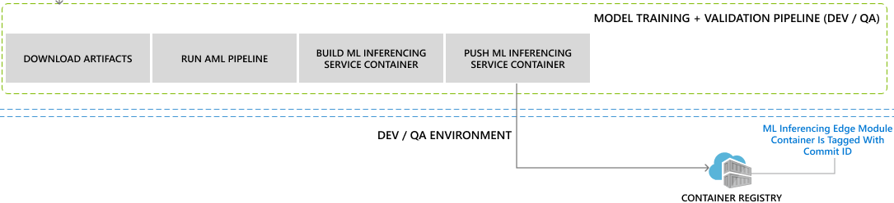

# CD ML Pipeline <!-- omit in toc -->

Model CD pipeline will run when a successful [Model CI pipeline](pr-ci-ml-pipeline.md) finishes. Please refer
to [Trigger one pipeline after another](https://docs.microsoft.com/en-us/azure/devops/pipelines/process/pipeline-triggers?view=azure-devops&tabs=yaml)
for details.

It comprises of the following steps:

1. **Download and Publish Artifacts**: This step downloads the artifacts collected from the CI pipeline. The artifacts are the model
 and pipeline code to run the model training and validation on Azure ML.

1. **Run Azure ML pipeline**:  This step is for the Model orchestrator to run the published Azure ML pipeline directly in the CD pipeline.
This may not be the best solution as DevOps agents are limited.
It may be useful for Azure Pipeline jobs to avoid holding-onto a DevOps agent for an extended period of time.
If the job needs to be run remotely, here are a few resources which may help:
[Server Job](https://docs.microsoft.com/en-us/azure/devops/pipelines/yaml-schema?view=azure-devops&tabs=schema%2Cparameter-schema#server)
and
[Run published pipeline task](https://marketplace.visualstudio.com/items?itemName=ms-air-aiagility.vss-services-azureml).
Details of the AML pipeline flow are in [aml-pipeline](aml-pipeline.md).

1. **Publish Inferencing Server**: This step is to package the model as the Inferencing server and push to Azure container registry (ACR).
It incudes the following steps:
    - Download model files
    - Build and push inference server to Azure Container Registry
    - Tag the model with the buildID and container name

    This step will be written as a template as it is something that will be called by the CI pipeline of Inference Server as well.

## Triggering the pipeline manually

1. Navigate to the recommendation model CD pipeline
1. Click `Run Pipeline`
1. Click `Run` to kick-off the pipeline
