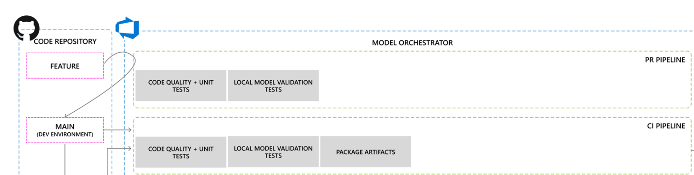

# ML Model PR & CI Pipelines <!-- omit in toc -->

Azure DevOps PR and CI pipeline will trigger when changes
are made to the model code or PR/CI pipeline code.

The PR pipeline will run when a pull request is made.
The CI pipeline will run when changes are merged into main.

Both pipelines will have code validation, but our `CI` pipeline will have an additional step to
capture and collect the necessary ml training artifacts in Azure pipelines.



The steps for the pipelines are:

1. `PR&CI` **Code quality and unit tests**: This step validates the quality of the code with our [Mega-Linter](./../development/linting.md)
to lint through the code and standardize,
and [PyTest](https://docs.pytest.org/en/latest/) to run unit testing and code coverage.

1. `PR&CI` **Local Model Validation Tests**: This step is validate the end-to-end
model training, scoring, and validation code without the need
to run on Azure ML. Note a few of these parameters are default values defined in the pipeline.

```yml
  - script: |
      python -m create_dataset --output-folder ${{ parameters.dataWorkingDir }}  && \
      python -m main --data-folder ${{ parameters.dataWorkingDir }} --output-folder ${{ parameters.modelWorkingDir }} && \
      python -m register_model --data-folder ${{ parameters.modelWorkingDir }} --model-name ${{ parameters.modelName }} \
      --build-id ${{ parameters.localBuildId }} --build-source ${{ parameters.localBuildSource }}
    displayName: 'Run local model validation tests'
    workingDirectory: ${{ parameters.workingDir }}
    failOnStderr: true
```

1. `CI Only` **Package Artifacts**: This step is to collect **only** the model and pipeline code
that are required to run the model training and
validation pipeline. The collected code will then be published to the
Azure Pipeline artifacts. Please refer to
[publish artifacts in Azure Pipelines](https://docs.microsoft.com/en-us/azure/devops/pipelines/artifacts/pipeline-artifacts?view=azure-devops&tabs=yaml#publishing-artifacts)
for more details.

Here is a sample `PR` yml template (not working code):

```yml
trigger: none

pool:
  vmImage: 'ubuntu-18.04'

variables:
- template: <path-to-common-or-specific-variables>

jobs:
- job: ml_validation
  displayName: 'Run ML validation tests'
  steps:
  - template: <path-to-validation-template>
    parameters:
        workingDir: $(aiInferencingDockerWorkingDir)
        pythonVersion: $(pythonVersion)
        modelName: $(modelName)
```

Here is a sample `CI` yml template (which is essentially the exact same as above
but with a collect & publish artifacts step):

```yml
trigger: none

pool:
  vmImage: 'ubuntu-18.04'

variables:
- template: <path-to-common-or-specific-variables>

jobs:
- job: ml_validation
  displayName: 'Run ML validation tests'
  steps:
  - template: <path-to-validation-template>
    parameters:
        workingDir: $(aiInferencingDockerWorkingDir)
        pythonVersion: $(pythonVersion)
        modelName: $(modelName)

- task: CopyFiles@2
    displayName: 'Collect Artifacts'
    inputs:
      Contents: |
        aml/*
        scripts/*
        requirements.txt
      TargetFolder: $(Build.ArtifactStagingDirectory)
      SourceFolder: $(aiInferencingDockerWorkingDir)

  - task: PublishPipelineArtifact@1
    displayName: 'Publish Artifacts'
    inputs:
      targetPath: $(Build.ArtifactStagingDirectory)
      artifactName: $(modelName)
```

Both of the pipelines above can use the same model training validation template
because they both do the same validation steps, but CI publishes the artifacts after.
