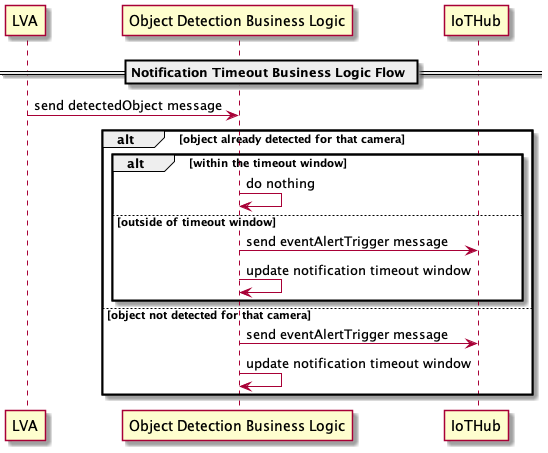

# Business Logic Module <!-- omit in toc -->

The business logic is mostly responsible for deciding what to do with the AI inferencing results, this includes making a decision on
when to send a message to the IoT Hub and the contents of that message. Your business logic might also include other functions depending
on your requirements. There are potentially many different use cases that would require a business logic module, one of those use cases
is object detection.

## Sections <!-- omit in toc -->

- [Object Detection](#object-detection)
  - [Configurable Parameters](#configurable-parameters)
  - [LVA Message Metadata](#lva-message-metadata)
    - [Incoming IoT Hub Message](#incoming-iot-hub-message)
    - [Event-based recording](#event-based-recording)
  - [Notification Timeout](#notification-timeout)
  - [Outgoing IoT Hub Message](#outgoing-iot-hub-message)

## Object Detection

Object detection is the use case that we will be focusing on for this sample. We will implement a generic business logic module
(`objectDetectionBusinessLogic`) that can be configurable for multiple object detection type scenarios. This will enable us to use
the same business logic module whether we are detecting a truck, a helmet, or even a fruit. There will be configurable properties to
make this possible.

### Configurable Parameters

These are values we will be able to set through environment variables and/or deployment manifest properties:

<!-- markdownlint-disable MD013 -->

| Type      | Name     | Description |
| -------   | -------  | ----------- |
| array     | objectTags             | A string list of objects that we want to report results for, given the confidence rate is met |
| num       | objectConfidence       | The threshold for the confidence value we want to report results for |
| num       | notificationTimeout    | Amount of time to check for when the last message to an IoT Hub was sent. In format of `#[s/m/h]` where `s` is seconds, `m` is minutes, and `h` is hours. Example `15m` |
<!-- markdownlint-enable MD013 -->

### LVA Message Metadata

The input message that we get from the AI Inferencing module is of type [azure.iot.device.message](https://docs.microsoft.com/python/api/azure-iot-device/azure.iot.device.message?view=azure-python).
If you are writing your own model, you will also need to implement your own AI inferencing service edge module. You will be in control
of what data your inferencing edge module sends to LVA; when LVA receives your AI inferencing results, it will pass that to the business
logic through the IoT Edge Hub.

#### Incoming IoT Hub Message

For reference, here is what the incoming message from the IoT Edge Hub into our business logic looks like:

```json
{
  "input_name": "detectedObjects",
  "message_id": "f036afa3-ec38-42a5-a194-731a247318b2",
  "custom_properties": {
      "$.cdid": "lva-sample-device",
      "$.cmid": "lvaEdge",
      "dataVersion": "1.0",
      "eventTime": "2020-11-24T19:22:05.912Z",
      "eventType": "Microsoft.Media.Graph.Analytics.Inference",
      "subject": "/graphInstances/Truck/processors/grpcExtension",
      "topic": "/subscriptions/00000000-0000-0000-0000-000000000000/resourceGroups/myResourceGroup/providers/microsoft.media/mediaservices/myMediaService"
  },
  "data": {
    "timestamp": 144508820431940,
    "inferences": [
      {
        "type": "entity",
        "subtype": "",
        "inferenceId": "",
        "relatedInferences": [],
        "entity": {
            "tag": {
              "value": "truck",
              "confidence": 0.70601773
            },
            "box": {
              "l": 0.46319517,
              "t": 0.5858206,
              "w": 0.065470256,
              "h": 0.058978155
            }
        },
        "extensions": {},
        "valueCase": "entity"
      }
    ]
  }
}
```

#### Event-based recording

The event-based scenario is when we get the AI inferencing results and our "success" conditions are met i.e. we see the object we want
to capture and the confidence is above our confidence threshold. For this scenario, we can use the topology file to configure the signal
gate processor. This can be achieved by setting the `minimumActivationTime`, `maximumActivationTime`, and `activationSignalOffset` properties
in the LVA graph topology file. As well as defining an assetSink that will capture the media.

When our success conditions are met, we send a message to LVA using the IoT Hub Module client to our defined output route which will
trigger the signal gate.

```json
// Define the route in the deployment template
"ObjectDetectionBusinessLogicToLVA": "FROM /messages/modules/objectDetectionBusinessLogic/outputs/alertTrigger INTO BrokeredEndpoint(\"/modules/lvaEdge/inputs/recordingTrigger\")",
```

```python
# Sending our message to the output route from the business logic code
await module_client.send_message_to_output(output_message, "alertTrigger")
```

```json
// Configuring the signal gate in the topology file for an event-based scenario
{
    "@type": "#Microsoft.Media.MediaGraphSignalGateProcessor",
    "name": "eventRecordingSignalGateProcessor",
    "inputs": [
        {
        "nodeName": "iotMessageSource"
        },
        {
        "nodeName": "rtspSource"
        }
    ],
    "activationEvaluationWindow": "PT1S",
    "activationSignalOffset": "-PT30S", // this value
    "minimumActivationTime": "PT60S", // this value
    "maximumActivationTime": "PT60S" // this value
}
```

```json
// Configuring the asset sink in the topology file
{
    "@type": "#Microsoft.Media.MediaGraphAssetSink",
    "name": "evrAssetSink",
    "assetNamePattern": "EVR-${System.GraphInstanceName}-${System.DateTime}",
    "segmentLength": "PT30S", // this value
    "LocalMediaCacheMaximumSizeMiB": "2048",
    "localMediaCachePath": "/var/lib/azuremediaservices/tmp/",
    "inputs": [
        {
        "nodeName": "evrSignalGateProcessor" // which signal gate to use
        }
    ]
}
```

### Notification Timeout

In your business logic, we also want to have a configurable notification timeout window, let's say no more frequent than every 15 minutes.
To accomplish this we can use a combination of logic on the edge module as well as in the cloud. On the business logic edge module, when
we get an inference event from LVA saying that an object has been detected, we will check if the business logic module has already sent
a message to IoT Hub for that topology instance in the last 15  minutes.

If no message was sent to IoT Hub for that topology instance we will send one with all the required metadata, and set a timeout before
the next message can be sent to IoT Hub for that instance. If a message was sent to IoT Hub recently for that topology instance and we
are already in the notification timeout window, the business logic module will just ignore the inference event.

The timeout window is specific for each topology instance. So if one camera detects an object and then immediately after that
a different camera detects an object, both cameras will send a message to IoT Hub, as they are from different topology instances.

This UML diagram helps visualize this flow:



### Outgoing IoT Hub Message

Here is a sample JSON sent by our business logic to IoT Hub.

```json
lva-sample-device/objectDetectionBusinessLogic:
{
  "graphInstance": "Truck",
  "deviceId": "lva-sample-device",
  "inferences": [
    {
      "type": "entity",
      "subtype": "",
      "inferenceId": "",
      "relatedInferences": [],
      "entity": {
        "tag": {
          "value": "truck",
          "confidence": 0.70601773
        },
        "box": {
          "l": 0.46319517,
          "t": 0.5858206,
          "w": 0.065470256,
          "h": 0.058978155
        }
      },
      "extensions": {},
      "valueCase": "entity"
    }
  ],
  "eventTime": "2020-12-01T23:59:45.227Z"
}
```
