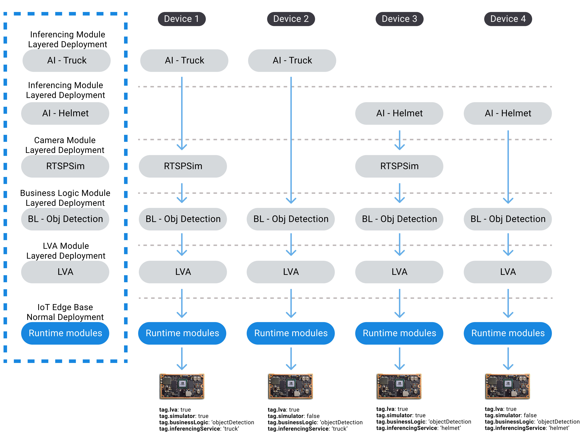
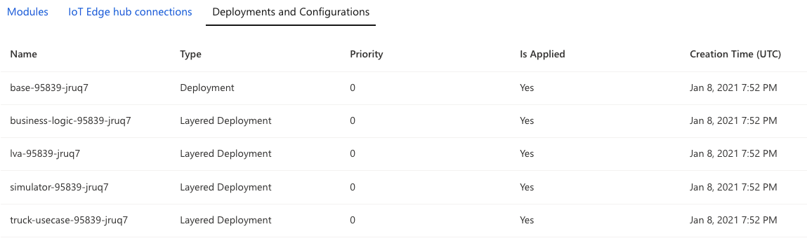

# IoT Edge Layered Deployment <!-- omit in toc -->

## Sections <!-- omit in toc -->

- [What is a layered deployment?](#what-is-a-layered-deployment)
- [`edge/deployments` folder structure](#edgedeployments-folder-structure)
- [Device twin tags](#device-twin-tags)
- [IoT Edge CD pipeline](#iot-edge-cd-pipeline)
  - [edgeLayeredDeployment script](#edgelayereddeployment-script)
    - [Delete Stage](#delete-stage)
    - [Deployment Stage](#deployment-stage)
    - [Status Stage](#status-stage)
  - [Edge Smoke Test](#edge-smoke-test)
    - [Known Issue](#known-issue)
- [Adding new scenarios](#adding-new-scenarios)

## What is a layered deployment?

Layered deployments are a type of IoT Edge automatic deployments that allow developers and operators to independently deploy subsets
of modules. This avoids the need to create an automatic deployment for every combination of modules that may exist across your device fleet.

Read more about [layered deployments here](https://azure.microsoft.com/blog/new-enhancements-for-azure-iot-edge-automatic-deployments/).

## `edge/deployments` folder structure

The structure of our deployment folder is set out in a way where the root contains the 4 core edge modules that need to be deployed to every
device (base, container insights, lva, rtspsim*). Then we have folders for the modules that could vary across different devices;
we have a folder for different business logic modules, and a folder for different AI inferencing service modules.

The thought behind this is that using device twin tags, you can indicate which of these manifests you want to deploy to any given device.

```txt
edge/deployments
  - layered.config.json
  - base.json
  - container.insights.json
  - lva.json
  - rtspsim.json
  - business-logic/
      - object.detection.json
  - inferencing-service/
      - yolov3.gpu.json
      - yolov3.json
  - mocks/
      - *.mock.json
```

> \* rtspsim is only a core module for our dev environment. In prod environment a real camera is used.

## Device twin tags

Layered deployments work by identifying which edge modules it should deploy to a given device based on the tags on that device. Each device
we provision for this project should contain the following tags:

```json
"tags": {
    "environment": "dev", // dev, prod or staging
    "lva": "true", // should always be true
    "simulator": "true", // refers to the rtsp camera simulator, can be disabled when using a real camera
    "inferencingService": "yolov3", // name of the AI model to use
    "businessLogic": "objectDetection", // we currently only have a business logic module for the object detection scenario
    "gpu": "false" // true if you want to utilize the GPU on this device and have set it up for that
}
```

For a larger picture of what level the tags are at in the twin json, here is a more fleshed out json:

```json
{
    "deviceId": "edge-dev-vm",
    "etag": "...",
    "deviceEtag": "...",
    "status": "enabled",
    "statusUpdateTime": "0001-01-01T00:00:00Z",
    "connectionState": "Connected",
    "lastActivityTime": "0001-01-01T00:00:00Z",
    "cloudToDeviceMessageCount": 0,
    "authenticationType": "sas",
    "x509Thumbprint": {
        "primaryThumbprint": null,
        "secondaryThumbprint": null
    },
    "modelId": "",
    "version": 3,
    "tags": {
        "environment": "dev",
        ...
    },
    "properties": {
        ...
    },
    "capabilities": {
        "iotEdge": true
    },
    "deviceScope": "..."
}
```

These tags make is really easy for us to deploy various different edge module combinations to our edge devices, without having to manually
change any source code or pipelines. In the example above, we are deploying the object detection business logic with the yolov3 AI inferencing
service.



## IoT Edge CD pipeline

The way our CD pipeline works for deploying the edge modules is by:

1. Replacing all of the tokens of all the edge module manifests inside the `edge/deployments` folder
1. Running the `edgeLayeredDeployment.sh` script to deploy all the edge modules, based on the tags provided

Result of a deployment:



### edgeLayeredDeployment script

This script runs the IoT edge deployment commands using Azure CLI. The script can be found under `edge/scripts/`. There are three
stages to the deployment script:

#### Delete Stage

In this stage we delete any existing deployments on our IoT hub; this needs to happen because there is a deployment limit of 100 deployments,
including layered.

#### Deployment Stage

First we create a normal deployment for the runtime modules (hub and agent).
Then we deploy our container insights module, as we are saying that should be deployed as part of every deployment.
Then we create layered deployments for the "optional" edge modules. We use `--target-condition` to determine which device a module
should be deployed to by querying the devices tags. And `--layered` is used to indicate that this is a layered deployment.

For example, this command will only deploy the object detection business logic module to devices where the tag `businessLogic` is equal
 to `objectDetection`.

```bash
az iot edge deployment create -d "business-logic-$buildId" -n $iotHub --content $deploymentsFolderPath/business-logic/object.detection.json --target-condition "tags.environment='$environment' and tags.businessLogic='objectDetection'" --layered
```

#### Status Stage

This stage does a check on the deployments to make sure they have been "Applied", which just means the deployment is active. This is
necessary as the deployments need to be active before we can run our smoke test and run our LVA console application.

### Edge Smoke Test

The [edge smoke test](../edge/scripts/edgeSmokeTest.sh) makes sure that all the deployments that we know should be
applied are applied to all devices.
It then makes sure that for each of the devices that is online, all the modules are up and running.
It does this by polling the module status until the device says it's running,
or we have waited long enough that we deem there is a failure.

#### Known Issue

There is a known issue where when we delete old deployments, sometimes they delete and the modules stop running right away,
but other times it might take a few minutes for the modules to stop running.
If it takes the modules a while to stop running, this can lead to a scenario where the smoke test runs and sees
the modules running and thinks everything is good. But really it's the old modules that are running that haven't stopped yet.

For a quick and hacky fix to this, you could add a sleep task to the [iot module deployment template](../.pipelines/templates/iot-module-deployment.yml)
before the smoke test. This would allow for more time for the modules to stop and thus when the smoke test runs it will
have a higher confidence that it is checking the newly deployed modules.

## Adding new scenarios

If we have new business logic and/or AI inferencing modules that we want to deploy, you will need to update a few things:

1. Determine the tag value for the new business logic and/or inferencing module

    For example: `tags.businessLogic='textAnalytics'` or `tags.inferencingService='invoice'`

1. Create a new deployment manifest for your new module under `edge/deployments` in the appropriate subfolder
1. Update the `layered.config.json` file and create a new entry for your scenario
    For example:

    ```json
    {
        "deployment": "business-logic",
        "path": "business-logic/text.analytics.json",
        "condition": "tags.businessLogic='textAnalytics'"
    },
    {
        "deployment": "ai-invoice",
        "path": "inferencing-service/invoice.json",
        "condition": "tags.inferencingService='invoice'"
    }
    ```

    > The path property is relative to the deployments folder.

1. Update a device's tags property, or provision a new device, using the tags you need to deploy your new scenario.
