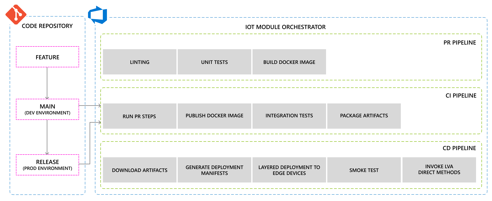

# DevOps Pipelines <!-- omit in toc -->

This document describes the CI/CD pipelines for the project.

## Sections <!-- omit in toc -->

- [High Level Overview](#high-level-overview)
- [Install ReplaceTokens Task](#install-replacetokens-task)
- [Variable Groups](#variable-groups)
  - [Variables](#variables)
  - [Secrets](#secrets)
  - [Getting servicePrincipalObjectId](#getting-serviceprincipalobjectid)
- [PR Pipelines](#pr-pipelines)
- [CI Pipelines](#ci-pipelines)
- [CD Pipeline](#cd-pipeline)
  - [IaC CD](#iac-cd)
    - [DEV Stage](#dev-stage)
    - [PROD Stage](#prod-stage)
    - [Templates](#templates)
  - [IoT CD](#iot-cd)
    - [DEV Stage](#dev-stage-1)
    - [PROD Stage](#prod-stage-1)
    - [Templates](#templates-1)
  - [Deployment of an LVA Module Using the IoT Edge AzDO Task](#deployment-of-an-lva-module-using-the-iot-edge-azdo-task)
  - [Known Issues](#known-issues)

## High Level Overview

A high level overview of what is accomplished in PR, CI, and CD pipelines can be seen in this image



## Install ReplaceTokens Task

We are using a task in the CI and CD pipelines that does not come out of the box with Azure Pipelines.
The task must be given permissions by an Azure DevOps instance organization administrator.
The process to request access to the task is very simple, just go to
[this site](https://marketplace.visualstudio.com/items?itemName=qetza.replacetokens) and click on "get it free".
This will prompt you for what organization you want to add the task to, and you can submit the request to add it.

The task is being used to replace the edge module deployment manifest files with the proper environment variables so that they can be deployed.

## Variable Groups

### Variables

Normal variables that are required for our pipelines can be found in the variable templates that are checked in to our repository,
they can be inside this folder: `.pipelines/variables`

### Secrets

Secrets can be found in the `secrets_prod` and `secrets_dev` variable groups in the AzDO pipelines library. These variable groups are
key vault linked and need to be created manually after running the IaC pipeline.

- aadSpSecret
  - This secret must be added to the Key Vault
- acrPassword
  - This secret is automatically added to the Key Vault as part of the IaC pipeline
- iotHubConnectionString
  - This secret is automatically added to the Key Vault as part of the IaC pipeline

> NOTE: Once the Key Vault has been deployed through the IaC pipeline,
> you will need to manually create the aadSpSecret secret for the service principal secret

### Getting servicePrincipalObjectId

servicePrincipalObjectId is a variable that lives in [vars-dev.yml](../.pipelines/variables/vars-dev.yml) and [vars-prod.yml](../.pipelines/variables/vars-prod.yml).
The purpose of this variable is so that our pipelines have the ability to set secrets in the Key Vault.
The Key Vault is created by the IaC pipeline, and in that same IaC pipeline we need to write to the Key Vault.
Because of this, the Key Vault is created with an access policy such that the pipeline can create secrets.
The servicePrincipalObjectId is the id needed to accomplish that.

In order to get the value of servicePrincipalObjectId, go to the service connection for azure resources
that the pipeline is using when it runs. This can be found in the "Service Connections" section of Azure DevOps.
Then click on your service connection and click on "Manage service principal".
This will open up an azure portal tag and the resource will show the "Application (client) ID".
Copy that value to the clipboard and then run this command:

```bash
az ad sp show --id <application_id> --query objectId -o tsv
```

This command will return the value needed to set for servicePrincipalObjectId.

## PR Pipelines

There are two PR pipelines, one for the LVA console app, and one for the IoT Edge modules.
Both pipelines use the [python-code-validation.yml](../.pipelines/templates/python-code-validation.yml) template to:

- Setup the python version and tools
- Install requirements
- Run the linter
- Run the unit tests
- Publish test results

The console app pipeline ([lva-console-app.yml](../.pipelines/pr/lva-console-app.yml)) doesn't do anything else outside the template.

The IoT pipeline ([iot-edge-modules.yml](../.pipelines/pr/iot-edge-modules.yml))
has one additional step which builds the IoT Edge modules using the `AzureIoTEdge` task.

## CI Pipelines

There are two CI pipelines, one for the LVA console app, and one for the IoT Edge modules. These pipelines both have the same steps as
the PR pipelines, but with some additions.

[lva-console-app.yml](../.pipelines/ci/lva-console-app.yml) has one additional step
which will publish a pipeline artifact containing the console app. This is published
as an artifact as the release pipeline will need to run the console app as part of its steps.

[iot-edge-modules.yml](../.pipelines/ci/iot-edge-modules.yml) has two additional steps from the PR pipeline:

- The `AzureIoTEdge` task is used to publish the edge module containers to an Azure Container Registry
- A pipeline artifact step is used to publish the deployment manifest files required in the release (CD) pipeline

## CD Pipeline

There are two CD pipelines, one for deploying all of our Azure resources, and another that will deploy all of the IoT edge modules
that are defining in the deployment template.

### IaC CD

The deployment for Azure resources is can be found here [iac.yml](../.pipelines/cd/iac.yml)

#### DEV Stage

- This stage uses the `dev` environment

Steps:

1. Deploy common resources
    - This uses bicep to deploy: a Resource Group, Key Vault, Application Insights, and Container Registry
1. Deploy IoT resources
    - This uses bicep to deploy: an IoT Hub, Azure Media Service, Storage Account, Log Analytics
1. Deploy a VM with the IoT Edge runtime and LVA resources
    - This step is for dev environment only
    - This uses a script to deploy the VM using az cli

#### PROD Stage

- This stage uses the `prod` environment

Steps:

1. Deploy common resources
    - This uses bicep to deploy: a Resource Group, Key Vault, Application Insights, and Container Registry
1. Deploy iot resources
    - This uses bicep to deploy: an IoT Hub, Azure Media Service, Storage Account, Log Analytics

#### Templates

The IaC CD pipeline uses several templates:

- Common resources can be found under [iac-common.yml](../.pipelines/templates/iac-common.yml)
  - Uses Az CLI to:
    - Deploy the `/deploy/bicep/resourcegroup.bicep` file
    - Deploy the `/deploy/bicep/main.common.bicep` file
- IoT resources can be found under [iac-iot.yml](../.pipelines/templates/iac-iot.yml)
  - Uses Az CLI to deploy the `/deploy/bicep/main.iot.bicep` file
- Edge VM resources can be found under [iac-edge-vm.yml](../.pipelines/templates/iac-edge-vm.yml)
  - Checks if the VM already exists, if it does the rest of the steps in this template will not run
  - Creates an IoT Edge device registration within the IoT Hub deployed by the previous template
  - Generates SSH keys for the VM and stores them in the Key Vault
  - Uses Az CLI to deploy the `/deploy/bicep/main.network.bicep` file which deploys a VNet and Bastion
  - Uses the `/deploy/scripts/deployEdgeVM.sh` script to deploy the VM to the deployed VNet
    - This script uses the `/deploy/scripts/cloud-config.yml` file setup the VM with the IoT Edge runtime, provision the device,
      and download the video required for the LVA sample topology

### IoT CD

The deployment of the IoT Edge modules uses the [layered deployment process](./devops-layered-deployment.md).

[iot-edge-modules.yml](../.pipelines/cd/iot-edge-modules.yml) has the following stages:

#### DEV Stage

- This stage uses the `dev` environment

Steps:

 1. Deploy IoT Edge modules to the dev environment
 1. Run smoke tests to make sure edge modules are running
 1. Run the LVA console app to activate the LVA graph topology for the dev environment

#### PROD Stage

- This stage uses the `prod` environment and sits behind an approval gate

Steps:

1. Deploy IoT Edge modules to the prod environment
1. Run smoke tests to make sure edge modules are running
1. Run the LVA console app to activate the LVA graph topology for the prod environment

> Read more about environments in Azure DevOps [here](https://docs.microsoft.com/azure/devops/pipelines/process/environments?view=azure-devops)

#### Templates

The IoT Edge deployment steps are defined in the [iot-module-deployment.yml](../.pipelines/templates/iot-module-deployment.yml)
template file. Here are the steps in the pipeline:

- Download the artifacts published by the IoT CI pipeline (this contains the deployment manifests for our project)
- Set the IMAGE_TAG environment variable as this value needs to be the same value as the CI pipeline's build Id
- Replace all the parameters in the format `${EXAMPLE}` in our manifest files with pipeline variables
- Run the [edgeLayeredDeployment](../edge/scripts/edgeLayeredDeployment.sh) script to deploy modules to edge devices using the layered system

The LVA console steps are defined in the [lva-console-app.yml](../.pipelines/templates/lva-console-app.yml) template file.
Here are the steps in the pipeline:

- Download the artifacts published by the IoT CI pipeline
- Download the artifacts published by the LVA console app CI pipeline
- Run the [cleanupLvaEdgeModule](../edge/scripts/cleanupLvaEdgeModule.sh) script to deactivate and delete any active LVA topologies and instances*
- Set the python version, install tools and project requirements
- Run the LVA console app, given a specific operations file

> \*  This is an important step as we can't, with enough detail, know about specific code changes to determine if we need to update
> a topology, create a new instance, update an existing topology etc. Or if the user has just made changes to the IoT modules without
> changing the LVA aspects. A decision made early on for this project was that we don't want user input to trigger our pipelines, we'd like
> them to be fully automated. Without user input to help us determine the right course of action, fully-automating the management of
> LVA with every CD pipeline run becomes complicated very quickly. For this reason, the design decision has been made to deactivate and
> reconfigure LVA for every CD run. This might change overtime as the LVA team provide the right tools and features for LVA & devops.

### Deployment of an LVA Module Using the IoT Edge AzDO Task

When deploying the LVA edge module using the IoT Edge AzDO task, there seems to be some behavior where the properties are not set until
after the module is running, causing an error when the LVA module starts. After about five minutes, the LVA module is able to start correctly
as at that point, the desired properties are getting populated. To work around this, we have taken two steps:

1. Use the AzCLI pipeline task to deploy our edge modules, this takes significantly less time
1. Implemented a script to check the state of the LVA module on the device before running the LVA console app

### Known Issues

With the [CD IoT Edge Modules pipeline](../.pipelines/cd/iot-edge-modules.yml) it is referencing the artifacts
by using a [pipeline resource](https://docs.microsoft.com/azure/devops/pipelines/process/resources?view=azure-devops&tabs=schema#resources-pipelines)
which gets artifacts from other pipelines.
This is used so that CD is automatically triggered as soon as the referenced pipelines have a successful
build for a given trigger branch. The issue is that if you manually run the CD pipeline (not from an automatic trigger)
then it will just find the latest successful build for that pipeline resource, regardless of what branch that ran on.

So if you manually trigger the CD file to run on main, it will find the latest successful CI build and download that artifact
even if that artifact was created on someones test branch.
