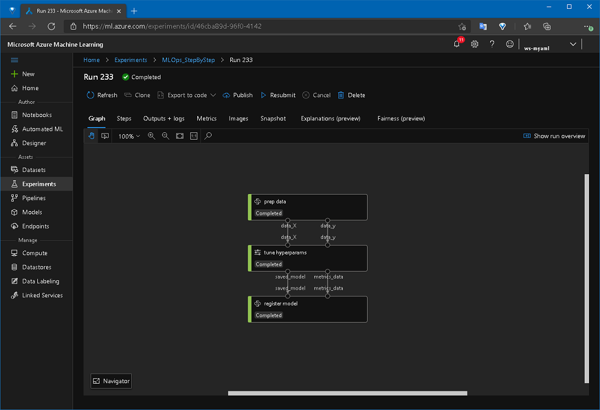
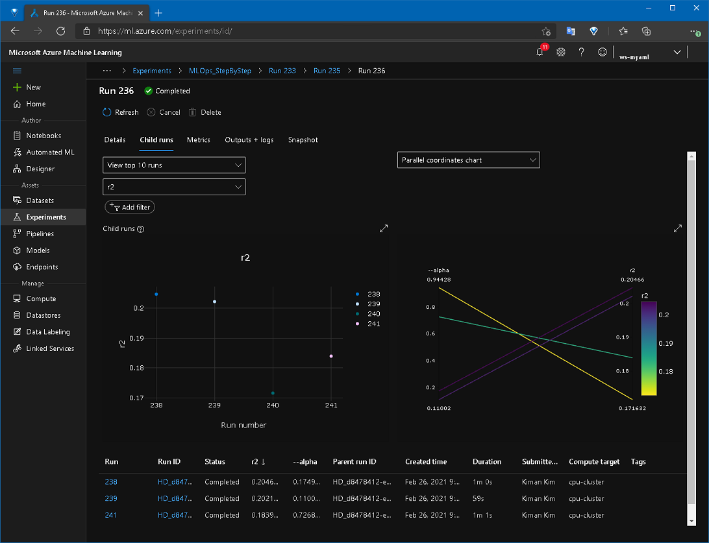

# Overview

This sample guides you on how to create a Azure Machine Learning pipeline with Hyper Parameter tuning.

__What does this sample demonstrate__:

* How to use the Hyper Parameter tune step in the Azure ML Pipelines
* Demo how to handle the metrics

__What doesn't this sample demonstrate__:

* Basics about Azure ML Pipeline

## Introduction

> Wrapping existing ML scripts Tutorial: https://github.com/liupeirong/MLOpsManufacturing/tree/main/samples/wrapping-existing-ml-scripts-tutorial

In the example above, we created a basic Azure ML Pipeline. This time, we're going to modify the existing code to change it to a pipeline that uses hyperparameter tuning to identify the best model.

The previous example was about [Linear Regression](https://scikit-learn.org/stable/modules/generated/sklearn.linear_model.LinearRegression.html), for the hyperparameter tuning example, we will modify it to use [Ridge](https://scikit-learn.org/stable/modules/generated/sklearn.linear_model.Ridge.html) and _alpha(Regularization strength)_ as a hyperparameter.

Questions:

- How to change an existing MLOps pipeline to use Hyper Parameters?
- How to retrieve the best model from the pipeline run using Hyper Parameters?

We will guide you step by step through both answers to these questions. 

# Getting Started

## Understanding Concepts

Hyperparameter tuning is one of the most challenging issues in Machine Learning, but using the Azure Machine Learning makes this problem a lot easier to solve.

Parameter sampling can specify hyperparameter values in a range or random, adjust the number of compute instances to train at the same time, or training runs with low performance can be early terminated, saving costs.

If you have an existing Azure ML pipeline code, you just need to do the following:

  - Set hyperparameter values and policies
  - Add the hyperparameters that need to be passed
  - Convert the existing train step to a hyperdrive step

Let's take a closer look!

## Setting Up Hyperparameters

`ml_service/pipelines/hyperparams.py` defines a helper class for creating a hyperparameter step easier, and below it defines the settings you need to set.

```python
# ml_service/pipelines/hyperparams.py
...
PARAMETER_SAMPLING = {
    '--alpha': uniform(0.05, 1.0)
}
PRIMARY_METRIC_NAME = 'r2'
PRIMARY_METRIC_GOAL = PrimaryMetricGoal.MAXIMIZE
EVALUATION_INTERVAL = 2
SLACK_FACTOR = 0.1
MAX_TOTAL_RUNS = 4
MAX_CONCURRENT_RUNS = 2
...
```

The purpose of each variable is as follows:
- PARAMETER_SAMPLING
  - Declares the variable to be used as a hyperparameter and specifies the format of the value.
  - In the code above, the `--alpha` parameter will have randomly uniform distributed values between 0.05 and 1.0.
  - If you want to use sampling other than [_RandomParameterSampling_](https://docs.microsoft.com/python/api/azureml-train-core/azureml.train.hyperdrive.randomparametersampling?view=azure-ml-py), see [here](https://docs.microsoft.com/azure/machine-learning/how-to-tune-hyperparameters#sampling-the-hyperparameter-space).
- PRIMARY_METRIC_NAME, PRIMARY_METRIC_GOAL
  - Specifies which metric to determine the best model.
  - The code above shows that the model with the r2 value of max is the best.
- EVALUATION_INTERVAL, SLACK_FACTOR
  - Bandit Policy allows early termination of low performance training.
  - EVALUATION_INTERVAL is the frequency of applying the policy.
  - SLACK_FACTOR specifies the allowable slack as a ratio.
- MAX_TOTAL_RUNS, MAX_CONCURRENT_RUNS
  - Specifies the maximum number of training runs and the maximum number of concurrent runs
  - In the code above, a total of 4 trainings are performed 2 times at the same time.
  > The number of concurrent runs is limited by the resources available in Compute cluster.

For a detailed description of parameter sampling, see https://docs.microsoft.com/azure/machine-learning/how-to-tune-hyperparameters.

## Modifying existing code

Since `alpha` is defined as a parameter, `src/steps/02_train.py` should receive this parameter and modify it for use.

```python
# src/steps/02_train.py
...
parser.add_argument('--alpha', type=float, default=0.1)
...
# train
model = Ridge(alpha=args.alpha)
model.fit(X_train, y_train)
...
```

## Modifying the pipeline build

Now in the code that creates the pipeline, we change the existing training step to the hyperdrive step.

```python
# ml_service/pipelines/build_pipeline.py
...
# ===== hyper drive setup //
config = ScriptRunConfig(source_directory='src/steps',
                            script='02_train.py',
                            compute_target=env.aml_compute_name,
                            arguments=[
                                '--data_X', data_X,
                                '--data_y', data_y,
                                '--model_name', env.aml_model_name,
                                '--test_size', pipeparam_test_size
                            ],
                            environment=environment)

hd_config = HyperParams().get_hd_config(config)

metrics_output_name = 'metrics_output'
metrics_data = PipelineData(name='metrics_data',
                            datastore=ds,
                            pipeline_output_name=metrics_output_name)

best_model_output_name = 'best_model_output'
saved_model = PipelineData(name='saved_model',
                            datastore=ds,
                            pipeline_output_name=best_model_output_name,
                            training_output=TrainingOutput("Model", model_file="outputs/mymodel"))

step2 = HyperDriveStep(
    name='tune hyperparams',
    hyperdrive_config=hd_config,
    inputs=[data_X, data_y],
    outputs=[saved_model],
    metrics_output=metrics_data)
# ===== // hyper drive setup
...
```

The _HyperDriveStep_ requires _ScriptRunConfig_  and _HyperDriveConfig_, and _PipelineData_ should connect to it to output metrics and get the best model.

## Running the pipeline

When the pipeline runs, it trains according to the number of instances in the _Compute Cluster_ and MAX_TOTAL_RUNS, MAX_CONCURRENT_RUNS in `hyperparams.py`.

$ python -m ml_service.pipelines.run_pipeline

> Using Compute Cluster may take a while to provision at the first time.

When it runs normally, the result should look similar like you can see the screenshot below.



In the Hyper drive step, you can see the trend of changes in hyperparameter values and primary metric values in the graph. Through this, you can analyze how hyperparameters affect each model.



After finishing the trainings, the model with max of _r2_ values as set in the primary metric in `ml_service/pipelines/hyperparams.py` is registered as the best model.

# Conclusion

We have looked at the basics of changing the existing Azure ML code into a pipeline for hyperparameter tuning. From now on, start working on increasing the accuracy of your model by the hyperparameter tune you want!

# References

- https://docs.microsoft.com/azure/machine-learning/how-to-tune-hyperparameters
- https://github.com/Azure/MachineLearningNotebooks/blob/master/how-to-use-azureml/machine-learning-pipelines/intro-to-pipelines/aml-pipelines-parameter-tuning-with-hyperdrive.ipynb
- https://docs.microsoft.com/python/api/azureml-pipeline-steps/azureml.pipeline.steps.hyper_drive_step.hyperdrivestep?view=azure-ml-py
- https://docs.microsoft.com/python/api/azureml-pipeline-core/azureml.pipeline.core.graph.trainingoutput?view=azure-ml-py
