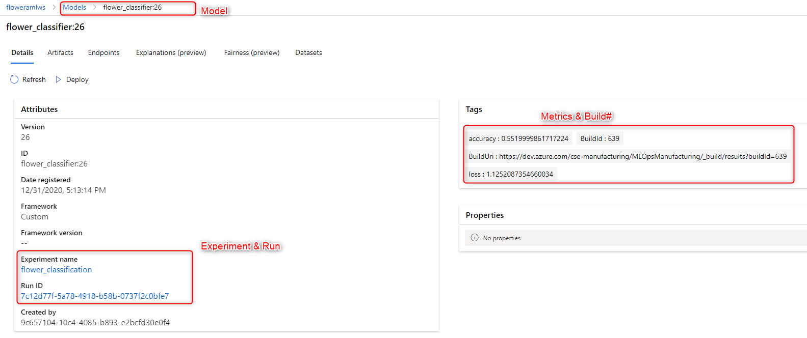
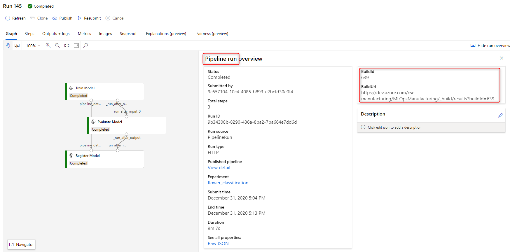
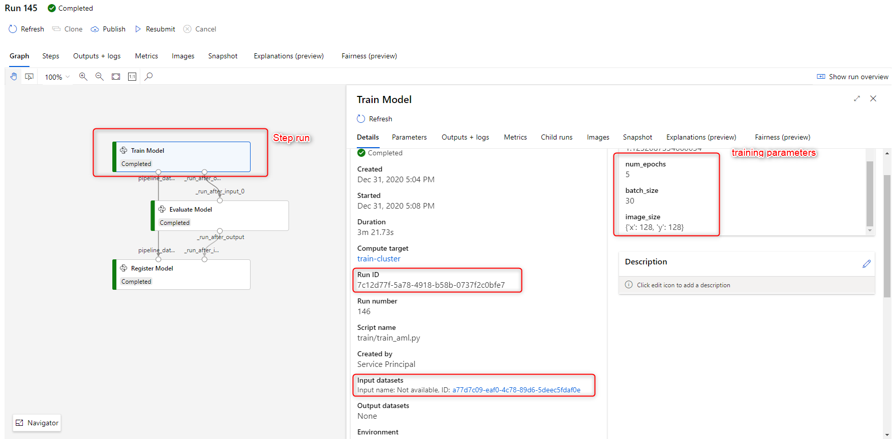
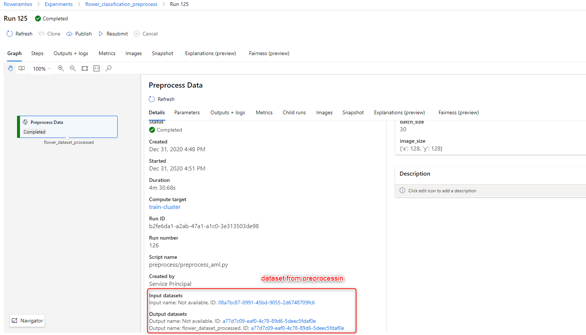

Data processing[](https://dev.azure.com/cse-manufacturing/MLOpsManufacturing/_build/latest?definitionId=33&branchName=main)
Model training[](https://dev.azure.com/cse-manufacturing/MLOpsManufacturing/_build/latest?definitionId=37&branchName=main)
Deploying and smoke testing[](https://dev.azure.com/cse-manufacturing/MLOpsManufacturing/_build/latest?definitionId=39&branchName=main)

# Overview

__What does this sample focus on demonstrating__:

* Track ML experimentation and model performance in Azure ML, and trace back to the source code build version and training dataset version.
* An ML model based on Tensorflow/Keras - how to manage dependencies in CI/CD, training, inferencing, and local development.
* Trains on image data instead of tabular data - how to use input/output file datasets in Azure ML.
* Retrains on new data - how to manage datasets and retraining as new data arrives.

__What doesn't this sample focus on demonstrating__:

* Extensive unit and integration tests - this sample doesn't have the level of unit tests or integration tests for production deployment. Refer to [this sample](../non-python-preprocess/ml_service/tests/pipelines) to mock Azure ML SDK and build a rich set of tests.
* Production scale inferencing - this sample stops at deploying the model to Azure Container Instance for smoke testing.

## Model Tracking
An ML `model` comes from a training `experiment` which consists of multipl `runs`. In this sample, each `run` is an Azure ML `pipeline` run which also consists of multiple `steps` or child runs. The goal is to track the following lineage as well as the input parameters to and output metrics from model training.

`model -> experiment -> pipeline run -> step runs -> datasets and devops build`






## Dependency Management

This solution takes dependencies on Python libraries, Azure ML SDK, Tensorflow and Keras packages. It also relies on Azure Cli, Azure ML extension for Azure Cli, and PyTest etc dependng on what needs to run and where. Dependencies are managed as following:

1. Packages required for ML training are defined in [ml_model/conda_dependencies.yml](ml_model/conda_dependencies.yml). When training in Azure, [Azure ML creates a docker image based on this file](ml_service/pipelines/build_training_pipeline.py).
2. For Azure DevOps pipelines to run unit tests, the Azure DevOps build agent must also have the dependent packages installed. This is defined in [devops_pipelines/build_agent/ci_dependencies.yml](devops_pipelines/build_agent/ci_dependencies.yml). The ML related dependencies are same as [ml_model/conda_dependencies.yml](ml_model/conda_dependencies.yml). However, it also needs linting and testing frameworks. The [build agent pipeline](devops_pipelines/build_agent/00-build-agent-pipeline.yml) then builds this conda environment into a Docker image to run as the build agent for all pipelines.
3. When running locally on the dev machine, you can either use a VSCode dev container or a conda environment. Dev dependencies is similar to build agent dependencies, except you may also want to install Jupyter notebook or debugger. Dev dependencies is defined in [local_development/dev_dependencies.yml](local_development/dev_dependencies.yml). The dev container [create a conda environment based on this file](.devcontainer/image/Dockerfile#L111), or you can simply [create a conda environment on the dev machine without a container](local_development/local_install_requirements.sh).  

> We use the same ML dependencies for running all ML operations in Azure ML. In fact, preprocessing or inferencing don't always need all the packages used in model training.  Similarly, not all Azure DevOps pipelines require the same dependencies in the build agent. You can create different Docker images with minimum required dependencies to keep the image size small, with the tradeoff of having to manage more images.

## Dataset Management

When preprocessing images, such as normalizing and resizing, the output of the processed data needs to be registered as a dataset so that models can be trained on such datasets and tracked. Also, we don't want to preprocess the data over and over just because we need to train the models over and over to get the best results. This means:

* [Preprocessing](ml_service/pipelines/build_data_processing_pipeline.py) and [training](ml_service/pipelines/build_training_pipeline.py) should be in separate pipelines.
* Datasets are immutable when you mount them. How do you _write_ a new output dataset for the processed images? You can of course use Azure Blob Storage SDK to write files to blob storage, and then use Azure ML SDK to create new datasets. But since we are already using Azure ML pipeline to produce the data, using [OutputFileDatasetConfig](ml_service/pipelines/build_data_processing_pipeline.py#L56) makes it easier to register a dataset as data is produced in an Azure ML pipeline step.

## Retrain on New Data

When new data arrives, there's no code change, so retraining the model should happen in the ML pipelines not DevOps pipelines. Additionally the newly trained model should be able to trace back to the new data it's trained on. This means: 

* Datasets should be immutable.
* Training dataset or dataset version can't be determined at pipeline publishing time, it has to be passed in as parameters at pipeline runtime. Put new data in a new folder. The data processing pipeline uses a [pre-registered dataset name](ml_service/pipelines/build_data_processing_pipeline.py#L68). It also [takes a folder name as its parameter](ml_service/pipelines/build_data_processing_pipeline.py#L70). When a new folder is specified for a run, [a new version of the dataset is registered](ml_model/preprocess/preprocess_aml.py#L98) and the folder is mounted. When this parameter is empty, the latest version of the dataset is used for training.

# Getting Started

## Prerequisite 
1. Whether you run this project locally or CI/CD pipelines in Azure DevOps, create Azure resources as documented [here](../../common/infrastructure/README.md). 
2. Review the folder structure explained [here]().

## Running locally
1. Make a copy of [.env.example](local_development/.env.example), place it in the root of this sample and rename it to `.env`. 
2. Install Anaconda or Mini Conda and create a Conda envrionment by running [local_install_requirements.sh](local_development/local_install_requirements.sh).
3. In VSCode, open the root folder of this sample, select the Conda environment created above as the Python interpretor.
4. Most of the code you'd want to run locally is in [ml_model](ml_model) folder. For code that doesn't depend on Azure ML, for example, [preprocess_images.py](ml_model/preprocess/preprocess_images.py), you can debug as usual. For code that depends on Azure ML, you don't the context Azure ML provides when running locally, such as access to Azure ML Dataset. In such cases, you'll need to write different code for local vs. remote runs. For example, to debug [preprocess_aml.py](ml_model/preprocess/preprocess_aml.py), do the following: 
    * open a terminal, navigate to `ml_model` folder of this sample, and run:
    ```bash
    image-classification-tensorflow/ml_model$ python -m debugpy --listen 5678 --wait-for-client preprocess/preprocess_aml.py --dataset_name flower_dataset --data_file_path /path/to/local/raw/images --output_dataset /path/to/processed/images
    ```
    * in VSCode, create a launch configuration to attach to the debugger, and F5:
    ```json
    "configurations": [
      {
        "name": "Python: Attach",
        "cwd": "${workspaceFolder}/samples/image-classification-tensorflow/ml_model",
        "type": "python",
        "request": "attach",
        "connect": {
          "host": "localhost",
          "port": 5678
        },
      }
    ]
    ```

## CI/CD in Azure DevOps

1. Create an Azure DevOps variable group that contains the following variables:

| name | description |
| --- | ---------- |
| ACR_SVC_CONNECTION | Service Connection to a Docker Container registry to store and retrieve Docker containers |
| AML_COMPUTE_CLUSTER_NAME | Azure ML compute cluster used for training |
| RESOURCE_GROUP | Azure resource group where the Azure ML workspace is located |
| WORKSPACE_NAME | Azure ML workspace name |
| WORKSPACE_SVC_CONNECTION | Service Connection to Azure ML workspace |
| ACI_DEPLOYMENT_NAME | Azure ML deployment name to Azure Container Instance |
| TEST_IMAGE_CLASSES | a comma separated list of image classification class names of images for smoke testing |
| TEST_IMAGE_URLS | a comma separated publicly accessible URLs of images for smoke testing |

> Note that you can also overwrite the variables defined in [variables-template.yml](samples/image-classification-tensorflow/devops_pipelines/variables-template.yml) with the ones defined in this variable group. Variables defined in the variable group takes precedence over variables-template.yml because of [how they are defined in Azure DevOps pipelines](devops_pipelines/03-train-evaluate-register-model.yml#L46). 

2. Create build agent pipeline
The build agent needs to run linting, unit tests, and call Azure ML SDK to publish Azure ML pipelines so that models can be trained, evaluated, and deployed in Azure ML pipelines. To create a Docker image for the build agent, create and run [00-build-agent-pipeline.yml](devops_pipelines/build_agent/00-build-agent-pipeline.yml).

3. Create other pipelines
Create the remaining CI/CD pipelines defined in [devops_pipelines](devops_pipelines) folder. Verify or adjust their triggers if needed. By default, they are configured to trigger on pull requests, merging to main, or as dependent pipelines completes.
