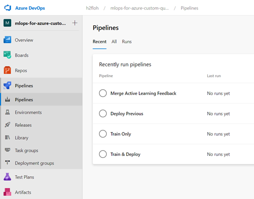

# Overview

Demonstrates how to use Azure DevOps to test and publish Custom Question Answering (formerly QnA Maker) Knowlegebases
from a editing stage/environment to a production stage/environment.

__What does this sample demonstrate__:

* Integrate Accuracy Test for Knowledgebases into Azure Pipelines
* Record Knowledgbase data, test data set and test result with Azure Storage
* Collect Active Learning Feedback data from production and display it in the editing Knowledgebase

__What doesn't this sample demonstrate__:

* How to increase accuracy of a Knowledgebase

## Model Tracking and Dataset Management

In case of Custom Question Answering the Knowledgebase data resembles the model. We track the dataset/model within
Azure Pipelines as a `Pipeline Artifact` and upload it to a storage account. Where it can be downloaded and redeployed.

## Dependency Management

This sample uses Azure Pipelines, Python scripts to interact with the Custom Question Answering API and an Accuracy Test tool
written in TypeScript.

* For the TypeScript part `npm` is used and the dependencies are managed in [package.json](accuarcy_test/package.json).
* For the Python part `pip` is used and the dependencies are managed in [pip-requirements.txt](kb/pip-requirements.txt).

> We recommend to use the devcontainer provided which has all tools preinstalled. Select `Remote Containers: Open Folder in Container...` from the VSCode command palette and navigate to this samples subfolder `samples/mlops-for-azure-custom-question-answering/`

# Getting Started

## Prerequisite

1. Docker & VSCode with Remote-Containers extension [installed](https://code.visualstudio.com/docs/remote/containers#_getting-started)
1. Fork of this repo on your [GitHub Account](https://github.com/join)
1. Create a [GitHub PAT]((https://docs.github.com/en/github/authenticating-to-github/keeping-your-account-and-data-secure/creating-a-personal-access-token)) with scope `admin:repo_hook`
1. Azure DevOps Organization with an [empty new project](https://docs.microsoft.com/en-us/azure/devops/organizations/projects/create-project?view=azure-devops&tabs=preview-page)

## Create the Azure resources

Let's go and create the resources we need for this sample:

* Custom Question Answering Service where we maintain content (EDIT)
* Custom Question Answering Service where we serve content (PROD)
* Storage Account to track and record artifacts

The provided IaC script will create a `.env` file with all settings and keys to set up
the pipelines in a second step. The scripts are bash scripts, recommend to use the provided devcontainer (see [here](#dependency-management) for instructions).

From within the `samples/mlops-for-azure-custom-question-answering` folder execute the following command and exchange `<salt>` with any string you like.
The salt is there to create globally unique names, which is required for the type of Azure Resources we are creating.

```bash
az login
bash iac-setup.sh <salt>
```

There should be some JSON output visible from the bicep/ARM deployment. You can verify a successful run if the `.env` file was created in the same directory and contains values in the sections `#### Values from IaC #####` and `#### Values from Post Deployment #####`.

## Configure Azure DevOps Pipelines

Great you are now ready to set up your Azure DevOps Project you prepared [earlier](#prerequisite).

First add your values to the following keys in the `.env` file:

|Key|Value Description|
|---|---|
|AZURE_DEVOPS_EXT_GITHUB_PAT|A [GitHub PAT]((https://docs.github.com/en/github/authenticating-to-github/keeping-your-account-and-data-secure/creating-a-personal-access-token)) with scope `admin:repo_hook`|
|YOUR_GIT_HUB_ID|Your [GitHub ID](https://github.com/join) sometimes called `handle`|
|YOUR_AZURE_DEV_OPS_ORG|Your Azure DevOps [Organization Name](https://docs.microsoft.com/en-us/azure/devops/organizations/accounts/create-organization?view=azure-devops)|
|YOUR_AZURE_DEV_OPS_PROJECT_NAME|Your Azure DevOps [Project Name](https://docs.microsoft.com/en-us/azure/devops/organizations/projects/create-project?view=azure-devops&tabs=preview-page)|

```text
#### Please exchange the values as described in README.md #####

AZURE_DEVOPS_EXT_GITHUB_PAT=''
YOUR_GIT_HUB_ID=''
YOUR_AZURE_DEV_OPS_ORG=''
YOUR_AZURE_DEV_OPS_PROJECT_NAME=''
```

So everything set up run this command from within the `samples/mlops-for-azure-custom-question-answering` folder:

```bash
bash pipeline-setup.sh
```

You should see some JSON results from each of the commands and some warnings that the Azure CLI commands are in preview.

> HINT: If your Azure Subscription account is different from your Azure DevOps account you can `az logout` and `az login` again with your Azure DevOps account before running `pipeline-setup.sh`.

You can verify if everything worked by checking following three menus in your Azure DevOps project:

* Pipelines->Pipelines

* Pipelines->Environments

* Pipelines->Library


## Run the Pipelines

So now you are set up to execute the pipelines. The pipelines will ask you for permissions to access the Variable Groups and permission to deploy to the environments.

|Pipeline|What it does|How to explore|
|---|---|---|
|[Train Only](devops_pipelines/kb/KB-Train-only.yml)|Publish Knowledgebase from Test slot of CQA to Prod slot on the EDIT environment, run accuracy test and upload results to storage|Look at the test results within the pipeline run, check the created artifacts in the storage account|
|[Train & Deploy](devops_pipelines/kb/KB-CD-Manual.yml)|Train Only + deploying the Knowledgbase content to Prod slot of CQA in the PROD environment|Go to https://www.qnamaker.ai portal and add additional QnA Pairs to the Edit Knowledgebase, rerun the pipeline and verify in the Portal that the changes are now also in the Production Knowledgebase|
|[Deploy Previous](devops_pipelines/kb/KB-CD-PreviousVersion.yml)|Loading a Knowledegbase version from storage account and deploy it to the PROD environment|Go to the storage account and copy one of the folder names, run this pipeline and verify that the contents of the KB.json file is now matching with the Knowledgebase in the PROD environment|
|[Merge Active Learning Feedback](devops_pipelines/al/AL-Merge-Manual.yml)|Will save a copy of the Knowledgebase in the PROD environment, and merge and Active Learning Data with the Knowledgebase in the EDIT environment|Use the PROD environment, ask questions (e.g. with the Test tool provided in the portal), as soon as you get [Active Learning Feedback data displayed](https://docs.microsoft.com/en-us/azure/cognitive-services/qnamaker/how-to/improve-knowledge-base#view-suggested-questions) in the PROD environment Knowledgebase run this pipeline and verify that afterwards you see the Active Learning Feedback also in the EDIT environment Knowledgebase|

## Cleanup

In order to clean up the Azure resources please run following script from within the `samples/mlops-for-azure-custom-question-answering` folder. There will be a confirmation prompt before deleting the Azure resources.

```bash
bash cleanup.sh
```

To cleanup Azure DevOps please [delete the project](https://docs.microsoft.com/en-us/azure/devops/organizations/projects/delete-project?view=azure-devops&tabs=browser) you created for this sample.
